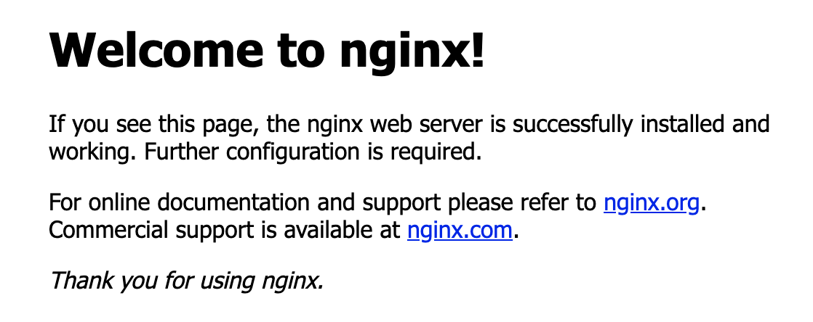

## Installing CAS and configuration under Ubuntu
{- In order to maintain security, please perform following configuration operations with normal user mode -}

System Environment Requirements:
<div align="center">
<table class="tg">
  <tr>
    <th class="tg-0pky">Environment Name</th>
    <th class="tg-0pky">Version</th>
  </tr>
  <tr>
    <td class="tg-0pky">OpenJDK</td>
    <td class="tg-0pky">11.0.4</td>
  </tr>
  <tr>
    <td class="tg-0pky">CAS</td>
    <td class="tg-0pky">6.1.x 及以上</td>
  </tr>
  <tr>
    <td class="tg-0pky">Tomcat</td>
    <td class="tg-0pky">9.0.24</td>
  </tr>
  <tr>
     <td class="tg-0pky">Nginx</td>
    <td class="tg-0pky">1.16.1</td>
  </tr>
</table>
</div>

### Apache Tomcat 9 configuration 
### Step 1 install OpenJDK
Update Current 'apt' Package:
```
sudo apt update
```
Install Default `Java OpenJDK` Package，11 is current version ，do not install it into Oracle Java.
```
sudo apt install default-jdk
```
Check current JDK version to make sure it meets environment requirements :
```
java -version
```

#### Step 2 Create Tomcat Account
Tomcat should not run under the root account for the sake of security issues , we need to create extra system user account.
```
sudo useradd -r -m -U -d /opt/tomcat -s /bin/false tomcat
```
#### Step 3 Install Tomcat
Go [Official Website](https://tomcat.apache.org/download-90.cgi)to download Tomcat 9
```
wget http://apache.01link.hk/tomcat/tomcat-9/v9.0.24/bin/apache-tomcat-9.0.24.tar.gz -P /tmp
```
Extract the compressed file and move it to the directory of the manager created in the step 2:
```
sudo tar xf /tmp/apache-tomcat-9*.tar.gz -C /opt/tomcat
```
To control Tomcat version better，we need to create a link named `latest` ，and point to installing address of Tomcat directly:
```
sudo ln -s /opt/tomcat/apache-tomcat-9.0.24 /opt/tomcat/latest
```
Authorize the manager:
```
sudo chown -RH tomcat: /opt/tomcat/latest
sudo sh -c 'chmod +x /opt/tomcat/latest/bin/*.sh'
```
#### Step 4 Create System Unit File
Create Service Unit:
```
sudo vim /etc/systemd/system/tomcat.service
===========================================================
[Unit]
Description=Tomcat 9 servlet container
After=network.target

[Service]
Type=forking

User=tomcat
Group=tomcat

Environment="JAVA_HOME=/usr/lib/jvm/default-java"
Environment="JAVA_OPTS=-Djava.security.egd=file:///dev/urandom -Djava.awt.headless=true"

Environment="CATALINA_BASE=/opt/tomcat/latest"
Environment="CATALINA_HOME=/opt/tomcat/latest"
Environment="CATALINA_PID=/opt/tomcat/latest/temp/tomcat.pid"
Environment="CATALINA_OPTS=-Xms512M -Xmx1024M -server -XX:+UseParallelGC"

ExecStart=/opt/tomcat/latest/bin/startup.sh
ExecStop=/opt/tomcat/latest/bin/shutdown.sh
[Install]
WantedBy=multi-user.target
```
> Please note that if the  path of JAVA_HOME is correct

Save and restart new unit file :
```
sudo systemctl daemon-reload
```
Next select the listening port, you don't need to enter the port number in ideal situation, but our Tomcat does not run as root for security reasons, so there is no way to achieve port 80 listening by directly changing the port number in the configuration file. So, we need port forwarding via iptables
```
sudo iptables -t nat -A PREROUTING -p tcp --dport 80 -j REDIRECT --to-port 8080
```
Save firewall rules:
```
sudo iptables-save > /etc/zsmiptables.rules
```
Set boot auto-loader:
```
vim /etc/network/interfaces
===========================================================
# 在末尾追加一行
pre-up iptables-restore < /etc/zsmiptables.rules
```
Start Tomcat Service:
```
sudo systemctl start tomcat
```
Please check Tomcat is runnning normally:
```
sudo systemctl status tomcat
```
Green indicates it running normally，set boot automatically:
```
sudo systemctl enable tomcat
```
### Nginx Configuration
#### Step 1 Create Nginx Running Account
Please do not run Nginx with root privileges due to security concern:
```
sudo useradd --shell /sbin/nologin --home-dir /usr/local/nginx nginx
```
#### Step 2 Install Dependent Library:
##### GCC Library
gcc would be pre-installed in some systems , we can check whether the library is available in the system environment by the following command:
```
gcc
```
You need to install GCC library If result turns out like this:
```
~bash: gcc: command not found
```
安装的命令为:
```
sudo apt-get install build-essentials
```
##### PCRE Library
```
sudo apt-get install libpcre3 libpcre3-dev
```
##### zlib Library
```
sudo apt-get install zlib1g zlib1g-dev
```
##### OpenSSL Library
```
sudo apt-get install openssl libssl-dev
```
##### Sysv-rc-conf Management Package
We prefer change the source in advance in case the installation fails :
```
sudo vim /etc/apt/sources.list
===========================================================
# Add Official Source Address
deb http://archive.ubuntu.com/ubuntu/ trusty main universe restricted multiverse
```
Update apt-get:
```
sudo apt-get update
```
Install sysv-rc-conf after upadte :
```
sudo apt-get install sysv-rc-conf
```
#### Step3 Download & Decompress Nginx
Create new directory to store resource :
```
sudo mkdir src && cd src
```
Download suitabele version from [Official Website](http://nginx.org/en/download.html):
```
sudo wget http://nginx.org/download/nginx-1.16.1.tar.gz
```
Extract to the desktop and detect the Nginx installation environment:
```
sudo tar xf nginx-1.16.1.tar.gz
```
#### Step 4 Configure HTTP Service
Configure HTTP 和 HTTPS Server:
```
cd nginx-1.16.1 && sudo ./configure --prefix=/usr/local/nginx-1.16.1 --user=nginx --group=nginx --with-http_ssl_module --with-http_gzip_static_module --with-http_stub_status_module
```
#### Step 5 Install Nginx
```
sudo make && sudo make install
```
Construct connection for updating afterwards:
```
sudo ln -s /usr/local/nginx-1.16.1 /usr/local/nginx
```
Check if modified version is valid:
```
/usr/local/nginx/sbin/nginx -v
```
Start Nginx:
```
sudo /usr/local/nginx/sbin/nginx
```
Visit `http://IP address of server public network`，If the browser opens the same as the image below，then the initial configuration of Nginx is successful :

Next, configure the boot self-starting file :
```
sudo vim /etc/init.d/nginx
===========================================================
#!/bin/bash
  
set -e
PATH=/usr/local/sbin:/usr/local/bin:/sbin:/bin:/usr/sbin:/usr/bin
DESC="nginx daemon"
NAME=nginx
DAEMON=/usr/local/nginx/sbin/$NAME
SCRIPTNAME=/etc/init.d/$NAME

# If the daemon file is not found, terminate the script.
test -x $DAEMON || exit 0

d_start() {
        $DAEMON || echo -n " already running"
}

d_stop() {
        $DAEMON -s stop || echo -n " not running"
}

d_reload() {
        $DAEMON -s reload || echo -n " could not reload"
}

case "$1" in
    start)
    echo -n "Starting $DESC: $NAME"
    d_start
    echo "."
    ;;
stop)
    echo -n "Stopping $DESC: $NAME"
    d_stop
    echo "."
    ;;
    reload)
    echo -n "Reloading $DESC configuration..."
    d_reload
    echo "reloaded."
    ;;
restart)
    echo -n "Restarting $DESC: $NAME"
    d_stop
# Sleep for two seconds before starting again, this should give the
# Nginx daemon some time to perform a graceful stop.
    sleep 2
    d_start
    echo "."
    ;;
*)
    echo "Usage: $SCRIPTNAME {start|stop|restart|reload}" >&2
    exit 3
    ;;
esac
exit 0
```
Authorize script:
```
sudo chmod +x /etc/init.d/nginx
```
Add boot:
```
update-rc.d  -f  nginx  defaults
```
It's crucial to turn on the boot:
```
sysv-rc-conf nginx on
```
Access`http://IP of server public network` after reboot，the following information means successful:
<div align="center"></div>

The corresponding nginx command turns out:
```
sudo /etc/init.d/nginx reload | stop | restart | start
```
#### Step 6 Configure Nginx
Edit nginx.conf :
```
sudo vim /usr/local/nginx/conf/nginx.conf
===========================================================
#user  nobody;
worker_processes  1;

#error_log  logs/error.log;
#error_log  logs/error.log  notice;
#error_log  logs/error.log  info;
error_log  logs/error.log  error;

pid        logs/nginx.pid;


events {
    worker_connections  1024;
}

http {
    include       mime.types;
    default_type  application/octet-stream;
    autoindex off;

    log_format  main  '$remote_addr - $remote_user [$time_local] "$request" '
                      '$status $body_bytes_sent "$http_referer" '
                      '"$http_user_agent" "$http_x_forwarded_for"';

    access_log  logs/access.log  main;
       sendfile       on;
    tcp_nopush     on;
    tcp_nodelay    on;
    #keepalive_timeout  0;
    keepalive_timeout  65;

    gzip  on;

    server {
        listen       80;
        server_name  localhost;

        #charset koi8-r;

        access_log  logs/host.access.log  main;

        location / {
            root   html;
            index  index.html index.htm;
        }

        #error_page  404              /404.html;

        # redirect server error pages to the static page /50x.html
        #
        error_page   500 502 503 504  /50x.html;
        location = /50x.html {
            root   html;
        }
                # proxy the PHP scripts to Apache listening on 127.0.0.1:80
        #
        #location ~ \.php$ {
        #    proxy_pass   http://127.0.0.1;
        #}

        # pass the PHP scripts to FastCGI server listening on 127.0.0.1:9000
        #
        #location ~ \.php$ {
        #    root           html;
        #    fastcgi_pass   127.0.0.1:9000;
        #    fastcgi_index  index.php;
        #    fastcgi_param  SCRIPT_FILENAME  /scripts$fastcgi_script_name;
        #    include        fastcgi_params;
        #}

        # deny access to .htaccess files, if Apache's document root
        # concurs with nginx's one
        #
        #location ~ /\.ht {
        #    deny  all;
        #}
    }

    # another virtual host using mix of IP-, name-, and port-based configuration
    #
    #server {
    #    listen       8000;
    #    listen       somename:8080;
    #    server_name  somename  alias  another.alias;

    #    location / {
    #        root   html;
    #        index  index.html index.htm;
    #    }
    #}

    # HTTPS server
    #
    #server {
    #    listen       443 ssl;
    #    server_name  localhost;

    #    ssl_certificate      cert.pem;
    #    ssl_certificate_key  cert.key;

    #    ssl_session_cache    shared:SSL:1m;
    #    ssl_session_timeout  5m;

    #    ssl_ciphers  HIGH:!aNULL:!MD5;
    #    ssl_prefer_server_ciphers  on;

    #    location / {
    #        root   html;
    #        index  index.html index.htm;
    #    }
    #}

}
```
Reload configuration:
```
sudo /etc/init.d/nginx reload
```
## Reference
This document refers to the blog written by following authors, click to see if you are interested. 
These blogs have more or less configuration problems, otherwise I don't need to write configuration documents.

### About OpenLDAP
- [配置Linux  NTP instance service](https://help.aliyun.com/document_detail/92803.html?spm=a2c4g.11186623.6.691.39e09c91NxpmTc)
- [Installation and Configuration of OpenLDAP under CentOS 7](https://mayanbin.com/post/openldap-in-centos-7.html)
- [Complete tutorial about building openldap on Centors7](https://blog.csdn.net/weixin_41004350/article/details/89521170)
- [Enable logging in openldap](https://blog.csdn.net/fanren224/article/details/80532277)
- [Configure CentOS上OpenLDAP Server using cn=config](https://www.jianshu.com/p/b5df1eb1f4de)
- [OpenLDAP : OpenLDAP Multi-Master Replication](https://www.server-world.info/en/note?os=CentOS_7&p=openldap&f=6)
- [Configure OpenLDAP Multi-Master Replication on Linux](https://www.itzgeek.com/how-tos/linux/centos-how-tos/configure-openldap-multi-master-replication-linux.html)
- [How to Add LDAP Users and Groups in OpenLDAP on Linux](https://www.thegeekstuff.com/2015/02/openldap-add-users-groups/)

### About CAS
- [How to install Tomcat 9 on Ubuntu 18.04](https://linuxize.com/post/how-to-install-tomcat-9-on-ubuntu-18-04/)
- [Configure the CAS module for LDAP and Active Directory](https://support.solarwinds.com/SuccessCenter/s/article/Configure-the-CAS-module-for-LDAP-and-Active-Directory)
- [Unified certification- Apereo CAS test](https://segmentfault.com/a/1190000018180578)
- [single sign-on architecture of Enterprise CAS](https://yuerblog.cc/2018/03/05/cas-sso-arch/)
- [sysv-rc-conf installation error under Ubuntu](https://blog.csdn.net/weixin_44606513/article/details/86815190)
- [Ubuntu-Nginx installation and set boot automatically](https://www.jianshu.com/p/c313318a2061)
- [nginx from zero to hero](https://klionsec.github.io/2017/11/20/nginx-sec/)


