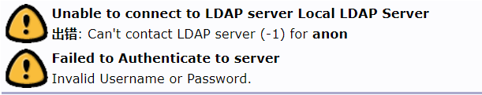

Table of Contents
=================
* [Account Authentication Service](#account-authentication-service)
    * [CentOS: OpenLDAP Installation and Configuration](#centos-openldap-installation-and-configuration)
       * [OpenLDAP Tree Structure](#openldap-tree-structure)
       * [OpenLADP User Information Collection](#openladp-user-information-collection)
       * [LDAP Synchronous Conditions](#ldap-synchronous-conditions)
       * [Shell Scripts](#shell-scripts)
       * [Firewall Rules](#firewall-rules)
          * [Inbound Rules](#inbound-rules)
          * [Outbound Rules](#outbound-rules)
          * [SELinux Settings](#selinux-settings)
       * [LDAP Basic Configuration](#ldap-basic-configuration)
          * [Step 1: install LDAP](#step-1-install-ldap)
          * [Step 2: Configure the syslog](#step-2-configure-the-syslog)
          * [Step 3: Configure the Password of Main Manager](#step-3-configure-the-password-of-main-manager)
          * [Step 4: Import Schemas](#step-4-import-schemas)
          * [Step 5: Configure the Top-level Domain of LDAP](#step-5-configure-the-top-level-domain-of-ldap)
       * [Multi-Master Replication Configuration](#multi-master-replication-configuration)
          * [Step 1: Configure the Syncprov module](#step-1-configure-the-syncprov-module)
          * [Step 2: Configure Mirror Replication](#step-2-configure-mirror-replication)
          * [Step 3: Enable syncprov module](#step-3-enable-syncprov-module)
          * [Step 4: Configure Mirror Database](#step-4-configure-mirror-database)
          * [Step 5: Clone the Structure of Organization](#step-5-clone-the-structure-of-organization)
          * [Step 6: Create Secondary Manager](#step-6-create-secondary-manager)
       * [Master-Slave Configuration](#master-slave-configuration)
       * [OpenLDAP Test](#openldap-test)
       * [phpLDAPadmin Configuration](#phpldapadmin-configuration)
          * [Bind public network IP and host name](#bind-public-network-ip-and-host-name)
          * [Configure Apache Services](#configure-apache-services)
          * [Install phpLDAPadmin](#install-phpldapadmin)
    * [Ubuntu: CAS Installation and Configuration](#ubuntu-cas-installation-and-configuration)
       * [Apache Tomcat 9 Configuration](#apache-tomcat-9-configuration)
       * [Step 1: install OpenJDK](#step-1-install-openjdk)
          * [Step 2: Create Tomcat Account](#step-2-create-tomcat-account)
          * [Step 3: Install Tomcat](#step-3-install-tomcat)
          * [Step 4: Create System Unit File](#step-4-create-system-unit-file)
       * [Nginx Configuration](#nginx-configuration)
          * [Step 1: Create Nginx Running Account](#step-1-create-nginx-running-account)
          * [Step 2: Install Dependency Library:](#step-2-install-dependency-library)
             * [GCC Library](#gcc-library)
             * [PCRE Library](#pcre-library)
             * [zlib Library](#zlib-library)
             * [OpenSSL Library](#openssl-library)
             * [Sysv-rc-conf Management Package](#sysv-rc-conf-management-package)
          * [Step 3: Download and Decompress Nginx](#step-3-download-and-decompress-nginx)
          * [Step 4: Configure HTTP Service](#step-4-configure-http-service)
          * [Step 5: Install Nginx](#step-5-install-nginx)
          * [Step 6: Configure Nginx](#step-6-configure-nginx)
    * [Reference](#reference)
       * [About OpenLDAP](#about-openldap)
       * [About CAS](#about-cas)
         
# Account Authentication Service
[](https://github.com/Hephaest/Simple-Java-Caculator/blob/master/LICENSE)
[](https://www.openldap.org/doc/admin24/)
[](https://apereo.github.io/cas/6.0.x/)

English | [中文](README_CN.md)

Latest update: `2019/09/13`

> This document describes the Single Sign-On based on CAS, helps trainees quickly learn this project achieving agile development.

## CentOS: OpenLDAP Installation and Configuration

> The following commands require **root** access.

We need at least **4** servers to implement the LDAP service (2 as LDAP providers and 2 as LDAP consumers), so even if one or two server are down, the whole system can still function:

```diff
! If possible, make a LDAP provider and a consumer in the same LAN to improve access speed.
! However, different pair of LDAP servers should be located in different LAN to free from geographical impact.
```
<div align="center">
<table class="tg">
  <tr align="center">
    <th class="tg-0pky" rowspan="2">Role</th>
    <th class="tg-0lax" colspan="2">IP Address</th>
    <th class="tg-0pky" rowspan="2">OS</th>
  </tr>
  <tr align="center">
    <td class="tg-0lax">Public IP</td>
    <td class="tg-0pky">LAN IP</td>
  </tr>
  <tr>
    <td class="tg-0pky">master01.hexang.org</td>
    <td class="tg-0lax">Private</td>
    <td class="tg-0pky">Private</td>
    <td class="tg-0pky">CentOS 7.4x86_64</td>
  </tr>
  <tr>
    <td class="tg-0pky">master02.hexang.org</td>
    <td class="tg-0lax">Private</td>
    <td class="tg-0pky">Private</td>
    <td class="tg-0pky">CentOS 7.4x86_64</td>
  </tr>
  <tr>
    <td class="tg-0pky">slave01.hexang.org</td>
    <td class="tg-0lax">Private</td>
    <td class="tg-0pky">Private</td>
    <td class="tg-0pky">CentOS 7.4x86_64</td>
  </tr>
  <tr>
    <td class="tg-0pky">slave02.hexang.org</td>
    <td class="tg-0lax">Private</td>
    <td class="tg-0pky">Private</td>
    <td class="tg-0pky">CentOS 7.4x86_64</td>
  </tr>
</table>
</div>


<div align="center">
<table class="tg">
  <tr>
    <th class="tg-dvpl">LDAP Administrator</th>
    <th class="tg-c3ow">Permission</th>
    <th class="tg-baqh">Password(provisional)</th>
  </tr>
  <tr>
    <td class="tg-dvpl">Main manager</td>
    <td class="tg-c3ow">readable, writable</td>
    <td class="tg-baqh">Private</td>
  </tr>
  <tr>
    <td class="tg-dvpl">Secondary manager</td>
    <td class="tg-c3ow">readable</td>
    <td class="tg-baqh">Private</td>
  </tr>
</table>
</div>

### OpenLDAP Tree Structure

The current organizational structure is relatively simple, each domain name level **ou** will create its own administrator due to privacy concerns:

<div align="center"></div>
### OpenLADP User Information Collection

We use `inetorgperson.ldif` of schemas to collect the user information, the data we need to collect has been listed as follows:

<div align="center">
<table class="tg">
  <tr>
    <th class="tg-0pky">Attribute</th>
    <th class="tg-0pky">Type</th>
    <th class="tg-0pky">Description</th>
  </tr>
  <tr>
    <td class="tg-0pky">uid</td>
    <td class="tg-0pky">char</td>
    <td class="tg-0pky">Username.</td>
  </tr>
  <tr>
    <td class="tg-0pky">cn</td>
    <td class="tg-0pky">char</td>
    <td class="tg-0pky">Name.</td>
  </tr>
  <tr>
    <td class="tg-0pky">jpegPhoto</td>
    <td class="tg-0pky">binary</td>
    <td class="tg-0pky">Profile photo.</td>
  </tr>
  <tr>
    <td class="tg-0pky">mail</td>
    <td class="tg-0pky">char</td>
    <td class="tg-0pky">Primary email address.</td>
  </tr>
    <tr>
    <td class="tg-0pky">preferredLanguage</td>
    <td class="tg-0pky">char</td>
    <td class="tg-0pky">Preferred Language.</td>
  </tr>
</table>
</div>

### LDAP Synchronous Conditions

OpenLDAP's synchronization schema needs to satisfy the following **6** conditions:

1. **Consistency of time clock**

   Install NTP

   ```shell
   yum -y install ntp
   ```

   To avoid errors between local time and server time, we should execute `ntpdate` at first.

   ```shell
   ntpdate ntp1.aliyun.com
   ```

   Then customize the NTP service

   ```shell
   vi /etc/ntp.conf
   ```

   Add a line comment in `server ntp xx iburst` then append a new line of NTP server information:

   ```shell
   server ntp1.aliyun.com iburst  # we use aliyun public network NTP server
   ```

   Save the changes and start the NTP service:

   ```shell
   systemctl start ntpd.service
   ```

   Then configure the restart self-executing NTP service:

   ```shell
   systemctl enable ntpd.service
   ```

   Check whether configurations take effect or not:

   ```shell
   ntpstat
   ```

2. **Consistency of OpenLDAP versions**

   We currently install the version of `2.4.4`.

3. **Domain name bidirectional resolutions**

   Not set yet.

4. **Consistency of initial master-slave and multi-master replication configuration**

   We will discuss this later.

5. **Consistency of data entries**

   Just add the data after configuration.

6. **Consistency of schemas**

   We will discuss this later.

### Shell Scripts

I've uploaded executable Shell scripts [here](https://hexang.org/sosconf/tech-team/ldap-account-server/tree/master/shell%20scripts). You can easily configure it by executing the scripts:

Step 1: Both LDAP providers and consumers need to execute the following commands:

```shell
# Synchro time first, then activate SELinux
chmod +x NTP_and_SELinux.sh
./NTP_and_SELinux.sh 'the provider's IP' 'the corresponding consumer's IP'
```

Step 2: Settings for LDAP providers:

```shell
chmod +x Config_Replication.sh
./Config_Replication.sh 'Main manager's password' 'Server's id'
```

Step 3: Only one of LDAP providers needs to execute the following commands:

```shell
chmod +x Database_Replication.sh
./Database_Replication.sh 'Secondary manager's password'
```

Step4: Settings for LDAP consumers:

```shell
chmod +x Slave_Configuration.sh
./Slave_Configuration.sh 'corresponding provider's IP' 'Main manager's password' 'Secondary manager's password'
```

### Firewall Rules

#### Inbound Rules

<div align="center">
<table class="tg">
  <tr>
    <th class="tg-0pky">Source</th>
    <th class="tg-0pky">Protocol port</th>
    <th class="tg-0pky">Strategy</th>
    <th class="tg-0pky">Description</th>
  </tr>
  <tr>
    <td class="tg-0pky">0.0.0.0/0</td>
    <td class="tg-0pky">TCP:22</td>
    <td class="tg-0pky">permit</td>
    <td class="tg-0pky">Allow Linux SSH login.</td>
  </tr>
  <tr>
    <td class="tg-0pky">0.0.0.0/0</td>
    <td class="tg-0pky">ICMP</td>
    <td class="tg-0pky">permit</td>
    <td class="tg-0pky">Support Ping services.</td>
  </tr>
  <tr>
    <td class="tg-0pky">0.0.0.0/0</td>
    <td class="tg-0pky">TCP:80</td>
    <td class="tg-0pky">permit</td>
    <td class="tg-0pky">Allow Web services HTTP(80).</td>
  </tr>
  <tr>
    <td class="tg-0pky">0.0.0.0/0</td>
    <td class="tg-0pky">TCP:443</td>
    <td class="tg-0pky">permit</td>
    <td class="tg-0pky">Allow Web services HTTP(443).</td>
  </tr>
    <tr>
    <td class="tg-0pky">0.0.0.0/0</td>
    <td class="tg-0pky">TCP:389</td>
    <td class="tg-0pky">permit</td>
    <td class="tg-0pky">Allow LDAP service.s</td>
  </tr>
  </tr>
    <tr>
    <td class="tg-0pky">0.0.0.0/0</td>
    <td class="tg-0pky">UDP:123</td>
    <td class="tg-0pky">permit</td>
    <td class="tg-0pky">Allow NTP services.</td>
  </tr>
</table>
</div>


#### Outbound Rules

<div align="center">
<table class="tg">
  <tr align="center">
    <th class="tg-0pky">Source</th>
    <th class="tg-0pky">Protocol port</th>
    <th class="tg-0pky">Strategy</th>
    <th class="tg-0pky">Description</th>
  </tr>
  <tr align="center">
    <td class="tg-0pky">0.0.0.0/0</td>
    <td class="tg-0pky">ALL</td>
    <td class="tg-0pky">permit</td>
    <td class="tg-0pky">-</td>
  </tr>

</table>
</div>

#### SELinux Settings

Activate SELinux:

```shell
sed -i '7s/^.*$/SELINUX=enforcing/' /etc/selinux/config
```

Restart the server to enable the SELinux configuration.

```shell
systemctl reboot
```

### LDAP Basic Configuration

#### Step 1: install LDAP

Install all the relevant packages in case of missing something.

```shell
# migrationtools --Used to migrate system users and groups to LDAP.
yum install -y openldap openldap-* migrationtools policycoreutils-python
```

BerkeleyDB configuration and authorize to the LDAP user.

```shell
cp /usr/share/openldap-servers/DB_CONFIG.example /var/lib/ldap/DB_CONFIG # copy
chown ldap:ldap /var/lib/ldap/DB_CONFIG # Authorization
```

Activate the LDAP server.

```shell
systemctl enable slapd
```

Start the LDAP service:

```shell
systemctl start slapd
```

Error messages will be generated at this time，please run the following command to catch the error message:

```shell
audit2allow -al
```

Create a new SELinux rule for LDAP:

```shell
audit2allow -a -M ldap_rule
```

Activate this rule:

```shell
semodule -i ldap_rule.pp
```

Check if the rule was loaded successfully:

```shell
[root@VM_0_15_centos ~]# semodule -l | grep ldap_rule
ldap_rule       1.0
```

Restart the LDAP service:

```shell
systemctl start slapd
```

Check the running status of LDAP, the green mark indicates successful running:

```shell
systemctl status slapd
```

Check port usage. By default, LDAP uses port 389 to listen：

```shell
netstat -tlnp | grep slapd
```

#### Step 2: Configure the syslog

Firstly, create the log then authorize files:

```shell
touch /var/log/slapd.log
chown -R ldap. /var/log/slapd.log
```

Appending the file to the system log:

```shell
echo "local4.* /var/log/slapd.log" >> /etc/rsyslog.conf
```

Restart the system log to take effect:

```shell
systemctl restart rsyslog
```

Next, update the level of the LDAP log:

```shell
vim loglevel.ldif
===========================================================
dn: cn=config
changetype: modify
add: olcLogLevel
# Set the log level. Level 296 is the sum of 256(Log connection/operation/result), 32(Search filter processing) and 8(Connection management).
olcLogLevel: 296
```

Modify the LDAP configuration:

```shell
ldapmodify -Y EXTERNAL -H ldapi:/// -f loglevel.ldif
```

In addition, shard the log for error checking:

```shell
vi /etc/logrotate.d/ldap
===========================================================
/var/log/slapd.log {
        prerotate
                /usr/bin/chattr -a /var/log/slapd/slapd.log
        endscript
        compress
        delaycompress
        notifempty
        rotate 100
        size 10M
        postrotate
                /usr/bin/chattr +a /var/log/slapd/slapd.log
        endscript
}
```

Check the current log configuration:

```shell
[root@VM_0_15_centos ~]# cat /etc/openldap/slapd.d/cn\=config.ldif |grep olcLogLevel
olcLogLevel: 296
```

#### Step 3: Configure the Password of Main Manager

```shell
touch chrootpw.ldif # Create a file.
echo "dn: olcDatabase={0}config,cn=config" >> chrootpw.ldif 
echo "changetype: modify" >> chrootpw.ldif # Specify modification type.
echo "add: olcRootPW" >> chrootpw.ldif # Add the olcRootPW configuration item.
slappasswd -s w8JFUEWjAsHBwLjjcQrCYiPP | sed -e "s#{SSHA}#olcRootPW: {SSHA}#g" >> chrootpw.ldif # Append ciphertext password.
```

Execute the following command to take effect:

```shell
ldapadd -Y EXTERNAL -H ldapi:/// -f chrootpw.ldif
```

#### Step 4: Import Schemas

The schema is in this path: /etc/openldap/schema/, I have written a script that can import all of the schemas:

```shell
vim import_schema.sh
===========================================================
all_files='ls /etc/openldap/schema/*.ldif'
for file in $all_files
do
  ldapadd -Y EXTERNAL -H ldapi:/// -f $file
done
```
#### Step 5: Configure the Top-level Domain of LDAP

```shell
vim changedomain.ldif
===========================================================
dn: olcDatabase={1}monitor,cn=config
changetype: modify
replace: olcAccess
olcAccess: {0}to * by dn.base="gidNumber=0+uidNumber=0,cn=peercred,cn=external,cn=auth" read by dn.base="cn=admin,dc=hexang,dc=org" read by * none

dn: olcDatabase={2}hdb,cn=config
changetype: modify
replace: olcSuffix
olcSuffix: dc=hexang,dc=org

dn: olcDatabase={2}hdb,cn=config
changetype: modify
replace: olcRootDN
olcRootDN: cn=admin,dc=hexang,dc=org

dn: olcDatabase={2}hdb,cn=config
changetype: modify
replace: olcRootPW
olcRootPW: # The password generated in step 2，you can find it by execute 'cat chrootpw.ldif'
```

Execute the following command to take effect:

```shell
ldapmodify -Y EXTERNAL -H ldapi:/// -f changedomain.ldif
```

### Multi-Master Replication Configuration

All LDAP providers must perform step **1** and step **2**:

#### Step 1: Configure the Syncprov module

```shell
vi mod_syncprov.ldif
===========================================================
dn: cn=module,cn=config
objectClass: olcModuleList
cn: module
olcModulePath: /usr/lib64/openldap
olcModuleLoad: syncprov.la
```

Execute the following command to take effect:

```shell
ldapadd -Y EXTERNAL -H ldapi:/// -f mod_syncprov.ldif
```

#### Step 2: Configure Mirror Replication

In this step please be aware of which server is configured:

**olcServerID** is a number to represent the server (**1** or **2**).

```shell
vi master.ldif
===========================================================
dn: cn=config
changetype: modify
add: olcServerID
olcServerID: 1 or 2
```

Execute the following command to take effect:

```shell
ldapmodify -Y EXTERNAL -H ldapi:/// -f master.ldif
```

Configuration mirror:
```diff
- "credentials" means main manager's unencrypted password.
```
```shell
vi configrep.ldif
===========================================================
dn: cn=config
changetype: modify
replace: olcServerID
olcServerID: 1 ldap://master01.hexang.org
olcServerID: 2 ldap://master02.hexang.org

dn: olcOverlay=syncprov,olcDatabase={0}config,cn=config
changetype: add
objectClass: olcOverlayConfig
objectClass: olcSyncProvConfig
olcOverlay: syncprov

dn: olcDatabase={0}config,cn=config
changetype: modify
add: olcSyncRepl
olcSyncRepl: rid=001 provider=ldap://master01.hexang.org binddn="cn=config"
  bindmethod=simple credentials= "Main manager's password"  searchbase="cn=config"
  type=refreshAndPersist retry="5 5 300 5" timeout=1
olcSyncRepl: rid=002 provider=ldap://master02.hexang.org binddn="cn=config"
  bindmethod=simple credentials="Main manager's password" searchbase="cn=config"
  type=refreshAndPersist retry="5 5 300 5" timeout=1
-
add: olcMirrorMode
olcMirrorMode: TRUE
```

Execute the following command to take effect:

```shell
ldapmodify -Y EXTERNAL -H ldapi:/// -f configrep.ldif
```

#### Step 3: Enable syncprov module

```shell
vi syncprov.ldif
===========================================================
dn: olcOverlay=syncprov,olcDatabase={2}hdb,cn=config
objectClass: olcOverlayConfig
objectClass: olcSyncProvConfig
olcOverlay: syncprov
olcSpSessionLog: 100
```

Execute the following command to take effect:

```shell
ldapadd -Y EXTERNAL -H ldapi:/// -f syncprov.ldif
```

#### Step 4: Configure Mirror Database 

```shell
vi olcdatabasehdb.ldif
===========================================================
dn: olcDatabase={1}monitor,cn=config
changetype: modify
replace: olcAccess
olcAccess: {0}to * by dn.base="gidNumber=0+uidNumber=0,cn=peercred,cn=external,cn=auth" read by dn.base="cn=admin,dc=hexang,dc=org" read by * none

dn: olcDatabase={2}hdb,cn=config
changetype: modify
replace: olcSuffix
olcSuffix: dc=hexang,dc=org
-
replace: olcRootDN
olcRootDN: cn=admin,dc=hexang,dc=org
-
replace: olcRootPW
olcRootPW: 'Main manager's password'
-
add: olcSyncRepl
olcSyncRepl: rid=003 provider=ldap://master01.hexang.org binddn="cn=admin,dc=hexang,dc=org" bindmethod=simple
  credentials='Secondary manager's password' searchbase="dc=hexang,dc=org" type=refreshAndPersist
  interval=00:00:05:00 retry="5 5 300 5" timeout=1
olcSyncRepl: rid=004 provider=ldap://master02.hexang.org binddn="cn=admin,dc=hexang,dc=org" bindmethod=simple
  credentials='Secondary manager's password' searchbase="dc=hexang,dc=org" type=refreshAndPersist
  interval=00:00:05:00 retry="5 5 300 5" timeout=1
-
add: olcDbIndex
olcDbIndex: entryUUID  eq
-
add: olcDbIndex
olcDbIndex: entryCSN  eq
-
add: olcMirrorMode
olcMirrorMode: TRUE
```

Execute the following command to take effect:

```shell
ldapmodify -Y EXTERNAL -H ldapi:/// -f olcdatabasehdb.ldif
```

#### Step 5: Clone the Structure of Organization

Set the directory Structure according to [OpenLDAP Tree Structure](#openldap-tree-structure).<br>

**ONLY** one of LDAP providers needs to execute the following command:

```shell
vim organisation.ldif
===========================================================
dn: dc=hexang,dc=org
objectClass: top
objectClass: dcObject
objectClass: organization
o: Hexang Open Source Life Style Platform
dc: hexang


dn: cn=admin,dc=hexang,dc=org
objectClass: organizationalRole
cn: admin

dn: ou=hexang.org,dc=hexang,dc=org
objectClass: organizationalUnit
ou: hexang.org

dn: ou=accounts,ou=hexang.org,dc=hexang,dc=org
objectClass: organizationalUnit
ou: accounts

dn: ou=hexang.com,dc=hexang,dc=org
objectClass: organizationalUnit
ou: hexang.com

dn: ou=accounts,ou=hexang.com,dc=hexang,dc=org
objectClass: organizationalUnit
ou: accounts

dn: ou=openingsource.org,dc=hexang,dc=org
objectClass: organizationalUnit
ou: openingsource.org

dn: ou=accounts,ou=openingsource.org,dc=hexang,dc=org
objectClass: organizationalUnit
ou: accounts

dn: ou=sosconf.org,dc=hexang,dc=org
objectClass: organizationalUnit
ou: openingsource.org

dn: ou=accounts,ou=sosconf.org,dc=hexang,dc=org
objectClass: organizationalUnit
ou: accounts
```

Execute the following command to take effect:

```shell
ldapadd -x -D cn=admin,dc=hexang,dc=org -W -f organisation.ldif
```

#### Step 6: Create Secondary Manager

Given to security, We need to create a read-only manager on the LDAP provider:

```shell
vi rpuser.ldif
===========================================================
dn: uid=rpuser,dc=hexang,dc=org
objectClass: simpleSecurityObject
objectclass: account
uid: rpuser
description: Replication User
userPassword: 'Secondary manager's password'
```

Execute the following command to take effect:

```shell
ldapadd -x -D cn=admin,dc=hexang,dc=org -w 'Main manager's password' -f rpuser.ldif
```

### Master-Slave Configuration

Please pay attention to the IP address of the LDAP provider:

```shell
vi syncrepl.ldif
===========================================================
dn: olcDatabase={2}hdb,cn=config
changetype: modify
add: olcSyncRepl
olcSyncRepl: rid=001
  provider=ldap://IP:389/
  bindmethod=simple
  binddn="cn=admin,dc=hexang,dc=org"
  credentials='Main manager's password'
  searchbase="dc=hexang,dc=org"
  scope=sub
  schemachecking=on
  type=refreshAndPersist
  retry="30 5 300 3"
  interval=00:00:05:00
```

Add configuration on LDAP server:

```shell
ldapadd -Y EXTERNAL -H ldapi:/// -f syncrepl.ldif
```

### OpenLDAP Test

```shell
vi ldaptest.ldif
===========================================================
dn: uid=ldaptest,ou=accounts,ou=hexang.org,dc=hexang,dc=org
objectClass: top
objectClass: person
objectClass: posixAccount
objectClass: shadowAccount
objectClass: inetOrgPerson
cn: Huang Xiaoming
uid: ldaptest
sn: Huang
uidNumber: 9988
gidNumber: 100
homeDirectory: /home/ldaptest
loginShell: /bin/bash
gecos: LDAP Replication Test User
userPassword: xiaoming
shadowLastChange: 17058
shadowMin: 0
shadowMax: 99999
shadowWarning: 7
shadowExpire: -1
mail: xiaoming.huang@qq.com
```

Add a member to the LDAP server:

```shell
ldapadd -x -W -D "cn=admin,dc=hexang,dc=org" -f ldaptest.ldif
```

Now you can query the xiaoming's information on any host:

```shell
ldapsearch -x uid=ldaptest -b dc=hexang,dc=org
```

Remove command:

```shell
ldapdelete -W -D "cn=admin,dc=hexang,dc=org" "uid=ldaptest,ou=accounts,ou=hexang.org,dc=hexang,dc=org"
```

If the effect of adding or deleting a member across all servers, that means it works.

### phpLDAPadmin Configuration

#### Bind public network IP and host name

Append records to the hosts file:

```shell
echo "(the server's public network IP)  Apache" >> /etc/hosts
```

#### Configure Apache Services

Check that Apache HTTP and PHP are installed:

```shell
[root@VM_0_15_centos ~]# rpm -qa | grep httpd # Check if the HTTP package has been installed
httpd-2.4.6-89.el7.centos.1.x86_64
httpd-tools-2.4.6-89.el7.centos.1.x86_64
httpd-devel-2.4.6-89.el7.centos.1.x86_64
httpd-manual-2.4.6-89.el7.centos.1.noarch
httpd-itk-2.4.7.04-2.el7.x86_64
```

Check the dependency packages are completely installed:

```shell
yum -y install httpd*
```

Configure Apache after installation, the configuration files are stored in this path: /etc/httpd/conf/ <br>
The default Apache is bind on port 80, just use the default port.
If there are no special needs, do not change the 'httpd.conf'.

Activate Apache:

```shell
systemctl start httpd.service
```

Check the usage of port 80. If port 80 doesn't listen, check if it is occupied by other services or the configuration file has syntax problems. 

```shell
[root@VM_0_15_centos ~]# lsof -i:80 # This is normal listening
COMMAND  PID   USER   FD   TYPE DEVICE SIZE/OFF NODE NAME
httpd   6045   root    3u  IPv4 151157      0t0  TCP *:http (LISTEN)
httpd   6046 apache    3u  IPv4 151157      0t0  TCP *:http (LISTEN)
httpd   6047 apache    3u  IPv4 151157      0t0  TCP *:http (LISTEN)
httpd   6048 apache    3u  IPv4 151157      0t0  TCP *:http (LISTEN)
httpd   6049 apache    3u  IPv4 151157      0t0  TCP *:http (LISTEN)
httpd   6050 apache    3u  IPv4 151157      0t0  TCP *:http (LISTEN)
```

Check whether Apache is successfully running:

```shell
service httpd status
```

If the output is the same as follows, that means your Apache is successfully running. Otherwise, check the log information to find the error.

<div align="center"></div>
<div align="center"></div>
#### Install phpLDAPadmin

Firstly, install phpldapadmin package:

```shell
yum install -y phpldapadmin
```

Modify configuration:

```shell
vim /etc/httpd/conf.d/phpldapadmin.conf
```

Line **11**: Change the "Require local" to "Require all granted":

```shell
#
#  Web-based tool for managing LDAP servers
#

Alias /phpldapadmin /usr/share/phpldapadmin/htdocs
Alias /ldapadmin /usr/share/phpldapadmin/htdocs

<Directory /usr/share/phpldapadmin/htdocs>
  <IfModule mod_authz_core.c>
    # Apache 2.4
    Require all granted # Change this. PS: I've changed this.
  </IfModule>
  <IfModule !mod_authz_core.c>
    # Apache 2.2
    Order Deny,Allow
    Deny from all
    Allow from 127.0.0.1
    Allow from ::1
  </IfModule>
</Directory>
```

Modify the PHP configuration, log into LDAP with the user name:

```shell
vim /etc/phpldapadmin/config.php
```

Line **398**: Change 'uid' to 'cn'：

```shell
$servers->setValue('login','attr','uid'); 
# Do like this: $servers->setValue('login','attr','cn');
```

Line **460**: Close anonymous login to protect data security：

```shell
// $servers->setValue('login','anon_bind',true); 
# Uncomment Line 460，Prevent default from becoming true. Change it into $servers->setValue('login','anon_bind',false);
```

Line **519**: Add 'cn', 'sn' to ensure uniqueness of username：

```shell
#  $servers->setValue('unique','attrs',array('mail','uid','uidNumber')); 
# Comment out and change it into $servers->setValue('unique','attrs',array('mail','uid','uidNumber','cn','sn'));
```

Restart the Apache to let the modified configuration take effect:

```shell
systemctl restart httpd
```

Now we can enter: ```http://your public network IP/ldapadmin/``` in the browser to get the architecture created in step **5**.
<div align="center"></div>

If you meet the problem as follow when log in:

<div align="center"></div>

Check if the SELinux disallows the LDAP connection:

```shell
# getsebool -a | grep httpd #below is an example of disallow connection
httpd_anon_write --> off
httpd_builtin_scripting --> on
httpd_can_check_spam --> off
httpd_can_connect_ftp --> off
httpd_can_connect_ldap --> off
httpd_can_connect_mythtv --> off
httpd_can_connect_zabbix --> off
httpd_can_network_connect --> off
httpd_can_network_connect_cobbler --> off
httpd_can_network_connect_db --> off
......
```

If so, enable the SELinux network connectivity (it's no need to restart Apache) :

```shell
setsebool -P httpd_can_network_connect on
```

Refresh the log in Page, then you can log in successfully.

## Ubuntu: CAS Installation and Configuration
```diff
- Given to security, please do not use root account.
```
**System Environment Requirements**:
<div align="center">
<table class="tg">
  <tr>
    <th class="tg-0pky">Environment Name</th>
    <th class="tg-0pky">Version</th>
  </tr>
  <tr>
    <td class="tg-0pky">OpenJDK</td>
    <td class="tg-0pky">11.0.4</td>
  </tr>
  <tr>
    <td class="tg-0pky">CAS</td>
    <td class="tg-0pky">6.1.x 及以上</td>
  </tr>
  <tr>
    <td class="tg-0pky">Tomcat</td>
    <td class="tg-0pky">9.0.24</td>
  </tr>
  <tr>
     <td class="tg-0pky">Nginx</td>
    <td class="tg-0pky">1.16.1</td>
  </tr>
</table>
</div>

### Apache Tomcat 9 Configuration 
### Step 1: install OpenJDK
Update current 'apt' package:
```
sudo apt update
```
Install default `Java OpenJDK` package, **11** is current version (**do not** use Oracle Java).
```
sudo apt install default-jdk
```
Check current JDK version to make sure it meets environment requirements :
```
java -version
```

#### Step 2: Create Tomcat Account
Tomcat should not run under the root account for the sake of security issues, we need to create an extra system user account.
```
sudo useradd -r -m -U -d /opt/tomcat -s /bin/false tomcat
```
#### Step 3: Install Tomcat
click [this link](https://tomcat.apache.org/download-90.cgi) to download Tomcat 9:
```
wget http://apache.01link.hk/tomcat/tomcat-9/v9.0.24/bin/apache-tomcat-9.0.24.tar.gz -P /tmp
```
Extract the compressed file and move it to the directory of the manager created in step 2:
```
sudo tar xf /tmp/apache-tomcat-9*.tar.gz -C /opt/tomcat
```
To control Tomcat version better, we need to create a link named `latest` and point to installing address of Tomcat directly:
```
sudo ln -s /opt/tomcat/apache-tomcat-9.0.24 /opt/tomcat/latest
```
Authorize the manager:
```
sudo chown -RH tomcat: /opt/tomcat/latest
sudo sh -c 'chmod +x /opt/tomcat/latest/bin/*.sh'
```
#### Step 4: Create System Unit File
Create service unit:
```
sudo vim /etc/systemd/system/tomcat.service
===========================================================
[Unit]
Description=Tomcat 9 servlet container
After=network.target

[Service]
Type=forking

User=tomcat
Group=tomcat

Environment="JAVA_HOME=/usr/lib/jvm/default-java"
Environment="JAVA_OPTS=-Djava.security.egd=file:///dev/urandom -Djava.awt.headless=true"

Environment="CATALINA_BASE=/opt/tomcat/latest"
Environment="CATALINA_HOME=/opt/tomcat/latest"
Environment="CATALINA_PID=/opt/tomcat/latest/temp/tomcat.pid"
Environment="CATALINA_OPTS=-Xms512M -Xmx1024M -server -XX:+UseParallelGC"

ExecStart=/opt/tomcat/latest/bin/startup.sh
ExecStop=/opt/tomcat/latest/bin/shutdown.sh
[Install]
WantedBy=multi-user.target
```
> Please check whether the path of JAVA_HOME is correct or not.

Save and restart new unit file :
```
sudo systemctl daemon-reload
```
Next, select the listening port. You don't need to enter the port number in an ideal situation but Tomcat does not run as root for security reasons, so there is no way to bind on port 80 directly. Hence, we need port forwarding via iptables:
```
sudo iptables -t nat -A PREROUTING -p tcp --dport 80 -j REDIRECT --to-port 8080
```
Save firewall rules:
```
sudo iptables-save > /etc/zsmiptables.rules
```
Set boot auto-loader:
```
vim /etc/network/interfaces
===========================================================
# Append a line at the end.
pre-up iptables-restore < /etc/zsmiptables.rules
```
Start Tomcat service:
```
sudo systemctl start tomcat
```
Please check Tomcat is runnning successfully:
```
sudo systemctl status tomcat
```
Green mark indicates it running successfully, execute reboot command:
```
sudo systemctl enable tomcat
```
### Nginx Configuration
#### Step 1: Create Nginx Running Account
Please do not run Nginx by root account due to security concerns:
```
sudo useradd --shell /sbin/nologin --home-dir /usr/local/nginx nginx
```
#### Step 2: Install Dependency Library:
##### GCC Library
gcc would be pre-installed in some systems, we can check whether the library is available in the system environment by the following command:
```
gcc
```
You need to install GCC library If the output is the same as follows:
```
~bash: gcc: command not found
```
The installation command is shown as follows:
```
sudo apt-get install build-essentials
```
##### PCRE Library
```
sudo apt-get install libpcre3 libpcre3-dev
```
##### zlib Library
```
sudo apt-get install zlib1g zlib1g-dev
```
##### OpenSSL Library
```
sudo apt-get install openssl libssl-dev
```
##### Sysv-rc-conf Management Package
We prefer to change the source in case that installation fails:
```
sudo vim /etc/apt/sources.list
===========================================================
# Add Official Source Address
deb http://archive.ubuntu.com/ubuntu/ trusty main universe restricted multiverse
```
Update apt-get:
```
sudo apt-get update
```
Install sysv-rc-conf after updates:
```
sudo apt-get install sysv-rc-conf
```
#### Step 3: Download and Decompress Nginx
Create a new directory to store resources:
```
sudo mkdir src && cd src
```
Download a suitable version from [Official Website](http://nginx.org/en/download.html):
```
sudo wget http://nginx.org/download/nginx-1.16.1.tar.gz
```
Extract to the desktop and detect the Nginx installation environment:
```
sudo tar xf nginx-1.16.1.tar.gz
```
#### Step 4: Configure HTTP Service
Configure HTTP and HTTPS server:
```
cd nginx-1.16.1 && sudo ./configure --prefix=/usr/local/nginx-1.16.1 --user=nginx --group=nginx --with-http_ssl_module --with-http_gzip_static_module --with-http_stub_status_module
```
#### Step 5: Install Nginx
```
sudo make && sudo make install
```
Create a link:
```
sudo ln -s /usr/local/nginx-1.16.1 /usr/local/nginx
```
Check whether modified version is valid or not:
```
/usr/local/nginx/sbin/nginx -v
```
Start Nginx:
```
sudo /usr/local/nginx/sbin/nginx
```
Visit `http://IP address of server public network`, if the browser opens the same as the image below，then the initial configuration of Nginx is successful:

Next, configure the self-executing file:
```
sudo vim /etc/init.d/nginx
===========================================================
#!/bin/bash
  
set -e
PATH=/usr/local/sbin:/usr/local/bin:/sbin:/bin:/usr/sbin:/usr/bin
DESC="nginx daemon"
NAME=nginx
DAEMON=/usr/local/nginx/sbin/$NAME
SCRIPTNAME=/etc/init.d/$NAME

# If the daemon file is not found, terminate the script.
test -x $DAEMON || exit 0

d_start() {
        $DAEMON || echo -n " already running"
}

d_stop() {
        $DAEMON -s stop || echo -n " not running"
}

d_reload() {
        $DAEMON -s reload || echo -n " could not reload"
}

case "$1" in
    start)
    echo -n "Starting $DESC: $NAME"
    d_start
    echo "."
    ;;
stop)
    echo -n "Stopping $DESC: $NAME"
    d_stop
    echo "."
    ;;
    reload)
    echo -n "Reloading $DESC configuration..."
    d_reload
    echo "reloaded."
    ;;
restart)
    echo -n "Restarting $DESC: $NAME"
    d_stop
# Sleep for two seconds before starting again, this should give the
# Nginx daemon some time to perform a graceful stop.
    sleep 2
    d_start
    echo "."
    ;;
*)
    echo "Usage: $SCRIPTNAME {start|stop|restart|reload}" >&2
    exit 3
    ;;
esac
exit 0
```
Authorize a script:
```
sudo chmod +x /etc/init.d/nginx
```
Add boot list:
```
update-rc.d  -f  nginx  defaults
```
This step is crucial for boot from boot:
```
sysv-rc-conf nginx on
```
Access `http://IP of server public network` after reboot, the following information indicates a success:
<div align="center"></div>

The corresponding nginx command as follows:
```
sudo /etc/init.d/nginx reload | stop | restart | start
```
#### Step 6: Configure Nginx
Edit nginx.conf:
```
sudo vim /usr/local/nginx/conf/nginx.conf
===========================================================
#user  nobody;
worker_processes  1;

#error_log  logs/error.log;
#error_log  logs/error.log  notice;
#error_log  logs/error.log  info;
error_log  logs/error.log  error;

pid        logs/nginx.pid;


events {
    worker_connections  1024;
}

http {
    include       mime.types;
    default_type  application/octet-stream;
    autoindex off;

    log_format  main  '$remote_addr - $remote_user [$time_local] "$request" '
                      '$status $body_bytes_sent "$http_referer" '
                      '"$http_user_agent" "$http_x_forwarded_for"';

    access_log  logs/access.log  main;
       sendfile       on;
    tcp_nopush     on;
    tcp_nodelay    on;
    #keepalive_timeout  0;
    keepalive_timeout  65;

    gzip  on;

    server {
        listen       80;
        server_name  localhost;

        #charset koi8-r;

        access_log  logs/host.access.log  main;

        location / {
            root   html;
            index  index.html index.htm;
        }

        #error_page  404              /404.html;

        # redirect server error pages to the static page /50x.html
        #
        error_page   500 502 503 504  /50x.html;
        location = /50x.html {
            root   html;
        }
                # proxy the PHP scripts to Apache listening on 127.0.0.1:80
        #
        #location ~ \.php$ {
        #    proxy_pass   http://127.0.0.1;
        #}

        # pass the PHP scripts to FastCGI server listening on 127.0.0.1:9000
        #
        #location ~ \.php$ {
        #    root           html;
        #    fastcgi_pass   127.0.0.1:9000;
        #    fastcgi_index  index.php;
        #    fastcgi_param  SCRIPT_FILENAME  /scripts$fastcgi_script_name;
        #    include        fastcgi_params;
        #}

        # deny access to .htaccess files, if Apache's document root
        # concurs with nginx's one
        #
        #location ~ /\.ht {
        #    deny  all;
        #}
    }

    # another virtual host using mix of IP-, name-, and port-based configuration
    #
    #server {
    #    listen       8000;
    #    listen       somename:8080;
    #    server_name  somename  alias  another.alias;

    #    location / {
    #        root   html;
    #        index  index.html index.htm;
    #    }
    #}

    # HTTPS server
    #
    #server {
    #    listen       443 ssl;
    #    server_name  localhost;

    #    ssl_certificate      cert.pem;
    #    ssl_certificate_key  cert.key;

    #    ssl_session_cache    shared:SSL:1m;
    #    ssl_session_timeout  5m;

    #    ssl_ciphers  HIGH:!aNULL:!MD5;
    #    ssl_prefer_server_ciphers  on;

    #    location / {
    #        root   html;
    #        index  index.html index.htm;
    #    }
    #}

}
```
Reload configuration:
```
sudo /etc/init.d/nginx reload
```
## Reference
This document refers to the blogs written by the following authors, they are listed as follows in case you are interested in. 
### About OpenLDAP
- [Configure Linux NTP instance service](https://help.aliyun.com/document_detail/92803.html?spm=a2c4g.11186623.6.691.39e09c91NxpmTc)
- [Installation and Configuration of OpenLDAP under CentOS 7](https://mayanbin.com/post/openldap-in-centos-7.html)
- [Complete tutorial about building openldap on Centors7](https://blog.csdn.net/weixin_41004350/article/details/89521170)
- [Enable logging in openldap](https://blog.csdn.net/fanren224/article/details/80532277)
- [CentOS: Configure OpenLDAP Server using cn=config](https://www.jianshu.com/p/b5df1eb1f4de)
- [OpenLDAP: OpenLDAP Multi-Master Replication](https://www.server-world.info/en/note?os=CentOS_7&p=openldap&f=6)
- [Configure OpenLDAP Multi-Master Replication on Linux](https://www.itzgeek.com/how-tos/linux/centos-how-tos/configure-openldap-multi-master-replication-linux.html)
- [How to Add LDAP Users and Groups in OpenLDAP on Linux](https://www.thegeekstuff.com/2015/02/openldap-add-users-groups/)

### About CAS
- [How to install Tomcat 9 on Ubuntu 18.04](https://linuxize.com/post/how-to-install-tomcat-9-on-ubuntu-18-04/)
- [Configure the CAS module for LDAP and Active Directory](https://support.solarwinds.com/SuccessCenter/s/article/Configure-the-CAS-module-for-LDAP-and-Active-Directory)
- [Unified certification- Apereo CAS test](https://segmentfault.com/a/1190000018180578)
- [single sign-on architecture of Enterprise CAS](https://yuerblog.cc/2018/03/05/cas-sso-arch/)
- [sysv-rc-conf installation error under Ubuntu](https://blog.csdn.net/weixin_44606513/article/details/86815190)
- [Ubuntu-Nginx installation and set boot automatically](https://www.jianshu.com/p/c313318a2061)
- [nginx from zero to hero](https://klionsec.github.io/2017/11/20/nginx-sec/)


