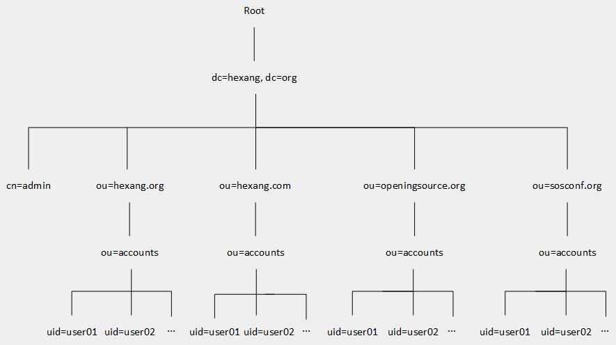
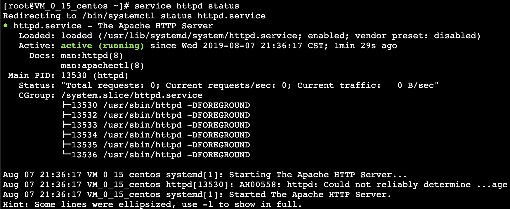
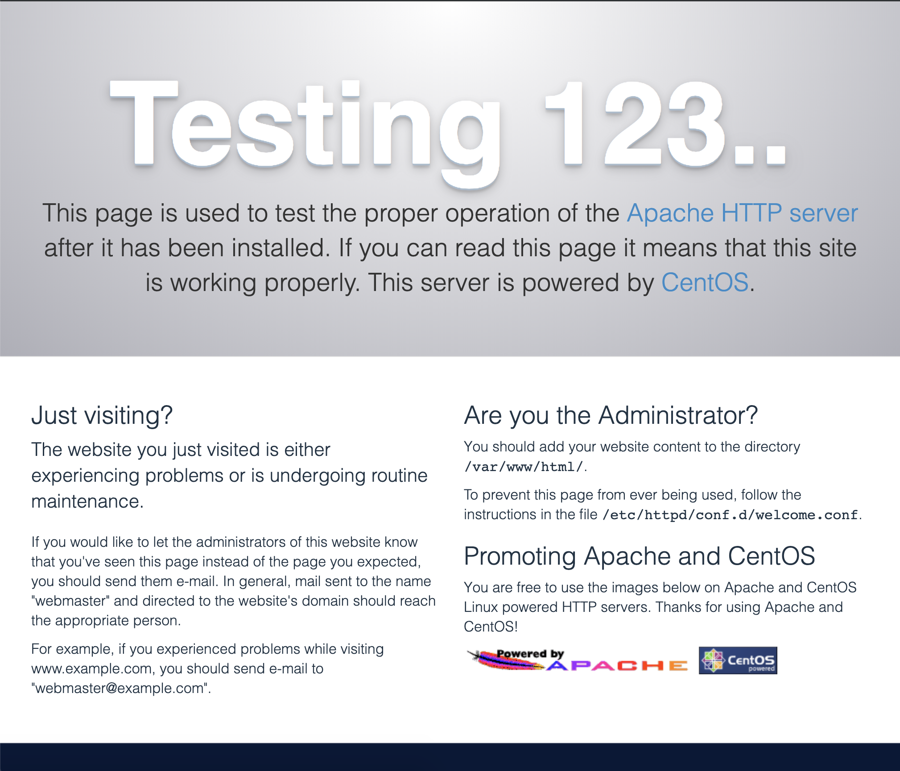
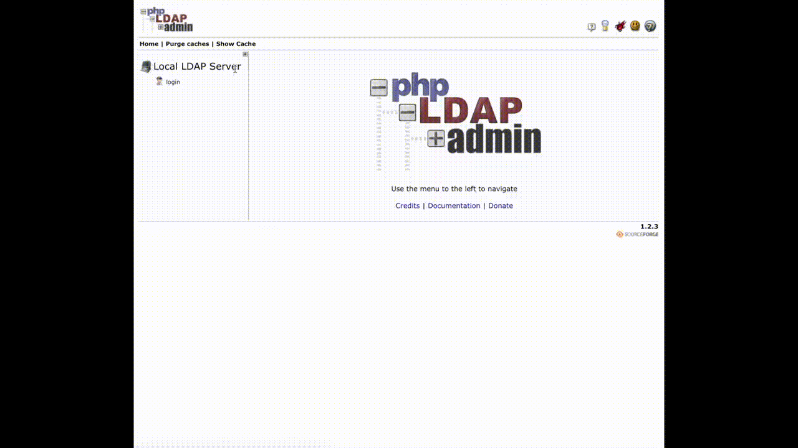

目录
=================
* [授权认证账户系统开发文档](#授权认证账户系统开发文档)
  * [CentOS 下 OpenLDAP 安装及配置方法](#centos-下-openldap-安装及配置方法)
     * [OpenLDAP 目录树示意图](#openldap-目录树示意图)
     * [OpenLDAP 用户信息收集](#openldap-用户信息收集)
     * [LDAP 同步条件](#ldap-同步条件)
     * [脚本执行文件](#脚本执行文件)
     * [防火墙规则](#防火墙规则)
        * [入战规则](#入战规则)
        * [出站规则](#出站规则)
        * [SELinux 设置](#selinux-设置)
     * [LDAP 基础配置](#ldap-基础配置)
        * [第一步 安装 LDAP](#第一步-安装-ldap)
        * [第二步 配置 syslog 记录 LDAP 服务](#第二步-配置-syslog-记录-ldap-服务)
        * [第三步 配置管理员密码](#第三步-配置管理员密码)
        * [第四步 导入 schema](#第四步-导入-schema)
        * [第五步 配置 LDAP 的顶级域](#第五步-配置-ldap-的顶级域)
     * [多主配置](#多主配置)
        * [第一步 配置 syncprov 模块](#第一步-配置-syncprov-模块)
        * [第二步 启用镜像配置](#第二步-启用镜像配置)
        * [第三步 启用 syncprov 模块](#第三步-启用-syncprov-模块)
        * [第四步 启用镜像数据库](#第四步-启用镜像数据库)
        * [第五步 复制组织结构](#第五步-复制组织结构)
        * [第六步 创建次级管理员](#第六步-创建次级管理员)
     * [主从配置](#主从配置)
     * [测试](#测试)
     * [phpLDAPadmin 配置](#phpldapadmin-配置)
        * [绑定公网 IP 和主机名](#绑定公网-ip-和主机名)
        * [配置 Apache 服务](#配置-apache-服务)
        * [安装 phpLDAPadmin](#安装-phpldapadmin)
  * [Ubuntu 下 CAS 安装及配置方法](#ubuntu-下-cas-安装及配置方法)
     * [Apache Tomcat 9 配置](#apache-tomcat-9-配置)
        * [第一步 安装 OpenJDK](#第一步-安装-openjdk)
        * [第二步 创建 Tomcat 用户](#第二步-创建-tomcat-用户)
        * [第三步 安装 Tomcat](#第三步-安装-tomcat)
        * [第四步 创建系统单元文件](#第四步-创建系统单元文件)
     * [Nginx 配置](#nginx-配置)
        * [第一步 创建 Nginx 运行账户](#第一步-创建-nginx-运行账户)
        * [第二步 安装依赖库](#第二步-安装依赖库)
           * [GCC 库](#gcc-库)
           * [PCRE 库](#pcre-库)
           * [zlib 库](#zlib-库)
           * [OpenSSL 库](#openssl-库)
           * [sysv-rc-conf 管理包](#sysv-rc-conf-管理包)
        * [第三步 下载与解压 Nginx](#第三步-下载与解压-nginx)
        * [第四步 配置 HTTP 服务](#第四步-配置-http-服务)
        * [第五步 安装 Nginx](#第五步-安装-nginx)
        * [第六步 配置 Nginx](#第六步-配置-nginx)
  * [参考链接](#参考链接)
     * [关于 OpenLDAP](#关于-openldap)
     * [关于 CAS](#关于-cas)

# 授权认证账户系统开发文档
[](https://github.com/Hephaest/Simple-Java-Caculator/blob/master/LICENSE)
[](https://www.openldap.org/doc/admin24/)
[](https://apereo.github.io/cas/6.0.x/)

> 本文档将介绍基于 CAS 实现的单点登录，帮助新朋友们（填坑者）快速了解项目进度并迅速开发。


最后一次更新于 `2019/08/31`

## CentOS 下 OpenLDAP 安装及配置方法

> 为了方便以下配置，请以 root 权限进行以下配置操作

实现 LDAP 服务我们需要至少 **4** 台服务器（主服务器和从服务器各两台）以防某台宕机服务瘫痪:

- 有条件的话主服务器和所属的从服务器最好在同一内网内，提高访问速度。
- 主服务器最好位于不同区，免受部分地域服务器瘫痪的影响。

<div align="center">
<table class="tg">
  <tr align="center">
    <th class="tg-0pky" rowspan="2">角色</th>
    <th class="tg-0lax" colspan="2">主IP地址</th>
    <th class="tg-0pky" rowspan="2">操作系统</th>
  </tr>
  <tr align="center">
    <td class="tg-0lax">公</td>
    <td class="tg-0pky">内</td>
  </tr>
  <tr>
    <td class="tg-0pky">master01.hexang.org</td>
    <td class="tg-0lax">148.70.168.17</td>
    <td class="tg-0pky">172.27.0.15</td>
    <td class="tg-0pky">CentOS 7.4x86_64</td>
  </tr>
  <tr>
    <td class="tg-0pky">master02.hexang.org</td>
    <td class="tg-0lax">120.27.250.20</td>
    <td class="tg-0pky">172.16.43.45</td>
    <td class="tg-0pky">CentOS 7.4x86_64</td>
  </tr>
  <tr>
    <td class="tg-0pky">slave01.hexang.org</td>
    <td class="tg-0lax">106.53.67.32</td>
    <td class="tg-0pky">172.16.0.14</td>
    <td class="tg-0pky">CentOS 7.4x86_64</td>
  </tr>
  <tr>
    <td class="tg-0pky">slave02.hexang.org</td>
    <td class="tg-0lax">47.96.239.221</td>
    <td class="tg-0pky">172.16.249.253</td>
    <td class="tg-0pky">CentOS 7.4x86_64</td>
  </tr>
</table>
</div>

<div align="center">
<table class="tg">
  <tr>
    <th class="tg-dvpl">LDAP 管理员</th>
    <th class="tg-c3ow">权限</th>
    <th class="tg-baqh">密码(暂定)</th>
  </tr>
  <tr>
    <td class="tg-dvpl">主管理者</td>
    <td class="tg-c3ow">可读可写</td>
    <td class="tg-baqh">w8JFUEWjAsHBwLjjcQrCYiPP</td>
  </tr>
  <tr>
    <td class="tg-dvpl">次级管理者</td>
    <td class="tg-c3ow">只读</td>
    <td class="tg-baqh">of2Pwxqt9Gc7TH8e</td>
  </tr>
</table>
</div>

### OpenLDAP 目录树示意图
当前的组织结构比较简单，后期可能会为每一个域名级别的 ou 创建自己的管理团队以便管理和隐私保护:
<div align="center"></div>

### OpenLDAP 用户信息收集
用户信息的收集使用的是 `inetorgperson.ldif` 的 schema，我们将会收集以下数据:

<div align="center">
<table class="tg">
  <tr>
    <th class="tg-0pky">属性名</th>
    <th class="tg-0pky">格式</th>
    <th class="tg-0pky">意义</th>
  </tr>
  <tr>
    <td class="tg-0pky">uid</td>
    <td class="tg-0pky">字符型</td>
    <td class="tg-0pky">用户名</td>
  </tr>
  <tr>
    <td class="tg-0pky">cn</td>
    <td class="tg-0pky">字符型</td>
    <td class="tg-0pky">用户真实全名</td>
  </tr>
  <tr>
    <td class="tg-0pky">jpegPhoto</td>
    <td class="tg-0pky">二进制</td>
    <td class="tg-0pky">用户头像</td>
  </tr>
  <tr>
    <td class="tg-0pky">mail</td>
    <td class="tg-0pky">字符型</td>
    <td class="tg-0pky">用于验证的用户邮箱</td>
  </tr>
    <tr>
    <td class="tg-0pky">preferredLanguage</td>
    <td class="tg-0pky">字符型</td>
    <td class="tg-0pky">语言偏好</td>
  </tr>
</table>
</div>

### LDAP 同步条件
OpenLDAP 的同步模式需要满足以下 **6** 个条件:
1. **服务器之间时间同步**

    安装 NTP
    ```
    yum -y install ntp
    ```
    因为服务器可能在国外，本机时间会与上源时间相差甚远，因此需要先执行 `ntpdate` 获得时间初始值:
    ```
    ntpdate ntp1.aliyun.com
    ```
    接着自定义 NTP 服务
    ```
    vi /etc/ntp.conf
    ```
    把 `server ntp 服务器 iburst` 注释掉，再后面新添加一行 NTP 服务器信息:
    ```
    server ntp1.aliyun.com iburst # 这里我们使用的是阿里云公网 NTP 服务器。
    ```
    保存更改后启动 NTP 服务:
    ```
    systemctl start ntpd.service
    ```
    接着配置重启自执行 NTP 服务:
    ```
    systemctl enable ntpd.service
    ```
    检查操作是否生效:
    ```
    ntpstat
    ```
2. **OpenLDAP 版本一致**

    下方使用的版本是`2.4.4`。    

3. **OpenLDAP 节点之间的域名可以相互解析**

    暂未设置。
    
4. **主从，主主同步的初始配置完全相同(包括目录树信息)**

    将下方配置复制粘贴即可。
    
5. **服务器之间数据条目相同**

    只要在配置之后添加数据即可。
    
6. **Schema 相同**

    将下方配置复制粘贴即可。

### 脚本执行文件
已将可执行 Shell 脚本 上传到[这里](https://hexang.org/sosconf/tech-team/ldap-account-server/tree/master/shell%20scripts)。可通过执行脚本一键配置:<br>
所有服务器都必须执行第 **1** 步。
```
# 先同步时间并开启 SELinux
chmod +x NTP_and_SELinux.sh
./NTP_and_SELinux.sh 第一台主服务器IP 第二台主服务器IP
```
第 **2** 步作针对两台主 LDAP 服务器:
```
chmod +x Config_Replication.sh
./Config_Replication.sh 管理员密码 服务器序号
```
第 **3** 步仅需在其中任意一台主服务器操作即可:
```
chmod +x Database_Replication.sh
./Database_Replication.sh 次级管理员密码
```
第 **4** 步作针对两台从 LDAP 服务器:
```
chmod +x Slave_Configuration.sh
./Slave_Configuration.sh 对应的主服务器IP 管理员密码 次级管理员密码
```

### 防火墙规则
    
#### 入战规则

<div align="center">
<table class="tg">
  <tr>
    <th class="tg-0pky">来源</th>
    <th class="tg-0pky">协议端口</th>
    <th class="tg-0pky">策略</th>
    <th class="tg-0pky">备注</th>
  </tr>
  <tr>
    <td class="tg-0pky">0.0.0.0/0</td>
    <td class="tg-0pky">TCP:22</td>
    <td class="tg-0pky">允许</td>
    <td class="tg-0pky">放通 Linux SSH 登录</td>
  </tr>
  <tr>
    <td class="tg-0pky">0.0.0.0/0</td>
    <td class="tg-0pky">ICMP</td>
    <td class="tg-0pky">允许</td>
    <td class="tg-0pky">支持 Ping 服务</td>
  </tr>
  <tr>
    <td class="tg-0pky">0.0.0.0/0</td>
    <td class="tg-0pky">TCP:80</td>
    <td class="tg-0pky">允许</td>
    <td class="tg-0pky">放通 Web 服务 HTTP(80)</td>
  </tr>
  <tr>
    <td class="tg-0pky">0.0.0.0/0</td>
    <td class="tg-0pky">TCP:443</td>
    <td class="tg-0pky">允许</td>
    <td class="tg-0pky">放通 Web 服务 HTTP(443)</td>
  </tr>
    <tr>
    <td class="tg-0pky">0.0.0.0/0</td>
    <td class="tg-0pky">TCP:389</td>
    <td class="tg-0pky">允许</td>
    <td class="tg-0pky">放通 LDAP 服务</td>
  </tr>
  </tr>
    <tr>
    <td class="tg-0pky">0.0.0.0/0</td>
    <td class="tg-0pky">UDP:123</td>
    <td class="tg-0pky">允许</td>
    <td class="tg-0pky">放通 NTP 服务</td>
  </tr>
</table>
</div>

#### 出站规则

<div align="center">
<table class="tg">
  <tr align="center">
    <th class="tg-0pky">来源</th>
    <th class="tg-0pky">协议端口</th>
    <th class="tg-0pky">策略</th>
    <th class="tg-0pky">备注</th>
  </tr>
  <tr align="center">
    <td class="tg-0pky">0.0.0.0/0</td>
    <td class="tg-0pky">ALL</td>
    <td class="tg-0pky">允许</td>
    <td class="tg-0pky">-</td>
  </tr>

</table>
</div>

#### SELinux 设置
开启 SELinux:
```
sed -i '7s/^.*$/SELINUX=enforcing/' /etc/selinux/config
```
重启服务器使 SELinux 配置生效。
```
systemctl reboot
```
### LDAP 基础配置
#### 第一步 安装 LDAP
全部装上, 免得有遗漏。
```
# migrationtools 用于把系统用户和组迁移到ldap。
yum install -y openldap openldap-* migrationtools policycoreutils-python
```
BerkeleyDB 配置, 并授权给 LDAP 用户。
```
cp /usr/share/openldap-servers/DB_CONFIG.example /var/lib/ldap/DB_CONFIG # 复制
chown ldap:ldap /var/lib/ldap/DB_CONFIG # 授权
```
开启 LDAP 服务。
```
systemctl enable slapd
```
接着我们尝试运行 LDAP 服务:
```
systemctl start slapd
```
这时候会生成错误信息，运行下方指令获取启动失败的原因:
```
audit2allow -al
```
我们将为 LDAP 单独创建一条规则:
```
audit2allow -a -M ldap_rule
```
加载这条规则:
```
semodule -i ldap_rule.pp
```
检查规则是否加载成功:
```
[root@VM_0_15_centos ~]# semodule -l | grep ldap_rule
ldap_rule       1.0
```
重新启动 LDAP 服务:
```
systemctl start slapd
```
检查 LDAP 运行状态, 标绿说明运行正常:
```
systemctl status slapd
```
查看端口使用情况, 默认情况下占用 389 端口：
```
netstat -tlnp | grep slapd
```
#### 第二步 配置 syslog 记录 LDAP 服务
首先创建日志，并对文件进行授权:
```
touch /var/log/slapd.log
chown -R ldap. /var/log/slapd.log
```
授权后追加到系统日志的配置里
```
echo "local4.* /var/log/slapd.log" >> /etc/rsyslog.conf
```
并重启系统日志程序, 使其生效:
```
systemctl restart rsyslog
```
接着更新 LDAP 日志的级别。首先创建中间文件:
```
vim loglevel.ldif
```
把下面这段拷贝复制到文件里
```
dn: cn=config
changetype: modify
add: olcLogLevel
# 设置日志级别。296级别是有256(日志连接/操作/结果), 32(搜索过滤器处理),8(连接管理)累加而来的。
olcLogLevel: 296
```
把日志功能添加到主配置文件里:
```
ldapmodify -Y EXTERNAL -H ldapi:/// -f loglevel.ldif
```
除此之外最好对日志进行切分, 便于错误排查:
```
vi /etc/logrotate.d/ldap
===========================================================
/var/log/slapd.log {
        prerotate
                /usr/bin/chattr -a /var/log/slapd/slapd.log
        endscript
        compress
        delaycompress
        notifempty
        rotate 100
        size 10M
        postrotate
                /usr/bin/chattr +a /var/log/slapd/slapd.log
        endscript
}
```
最后查看当前日志配置:
```
[root@VM_0_15_centos ~]# cat /etc/openldap/slapd.d/cn\=config.ldif |grep olcLogLevel
olcLogLevel: 296
```
#### 第三步 配置管理员密码
```
touch chrootpw.ldif # 创建文件
echo "dn: olcDatabase={0}config,cn=config" >> chrootpw.ldif 
echo "changetype: modify" >> chrootpw.ldif # 指定修改类型
echo "add: olcRootPW" >> chrootpw.ldif # 添加 olcRootPW 配置项
slappasswd -s w8JFUEWjAsHBwLjjcQrCYiPP | sed -e "s#{SSHA}#olcRootPW: {SSHA}#g" >> chrootpw.ldif # 追加密文密码。
```
执行修改 LDAP 配置命令:
```
ldapadd -Y EXTERNAL -H ldapi:/// -f chrootpw.ldif
```
#### 第四步 导入 schema
Schema 在 /etc/openldap/schema/ 目录里，我这边写了一个执行导入所有 schema 的脚本。
```
vim import_schema.sh
```
把下面这段拷贝复制到文件里。
```
all_files='ls /etc/openldap/schema/*.ldif'
for file in $all_files
do
  ldapadd -Y EXTERNAL -H ldapi:/// -f $file
done
```
#### 第五步 配置 LDAP 的顶级域
```
vim changedomain.ldif
===========================================================
dn: olcDatabase={1}monitor,cn=config
changetype: modify
replace: olcAccess
olcAccess: {0}to * by dn.base="gidNumber=0+uidNumber=0,cn=peercred,cn=external,cn=auth" read by dn.base="cn=admin,dc=hexang,dc=org" read by * none

dn: olcDatabase={2}hdb,cn=config
changetype: modify
replace: olcSuffix
olcSuffix: dc=hexang,dc=org

dn: olcDatabase={2}hdb,cn=config
changetype: modify
replace: olcRootDN
olcRootDN: cn=admin,dc=hexang,dc=org

dn: olcDatabase={2}hdb,cn=config
changetype: modify
replace: olcRootPW
olcRootPW: # 在第二步生成的密码，可通过 vim chrootpw.ldif 查看。
```
执行修改命令
```
ldapmodify -Y EXTERNAL -H ldapi:/// -f changedomain.ldif
```
### 多主配置
所有主服务器都必须执行第 **1** 步和第 **2** 步:

#### 第一步 配置 syncprov 模块
```
vi mod_syncprov.ldif
===========================================================
dn: cn=module,cn=config
objectClass: olcModuleList
cn: module
olcModulePath: /usr/lib64/openldap
olcModuleLoad: syncprov.la
```
在 LDAP 服务器上添加配置:
```
ldapadd -Y EXTERNAL -H ldapi:/// -f mod_syncprov.ldif
```
#### 第二步 启用镜像配置
接下来这一步请注意正在配置的是哪一台主服务器:

olcServerID 写主服务器对应的下标（1或2）。
```
vi master.ldif
===========================================================
dn: cn=config
changetype: modify
add: olcServerID
olcServerID: 1 或 2
```
在 LDAP 服务器上更改配置:
```
ldapmodify -Y EXTERNAL -H ldapi:/// -f master.ldif
```
配置镜像:
```
vi configrep.ldif
===========================================================
dn: cn=config
changetype: modify
replace: olcServerID
olcServerID: 1 ldap://master01.hexang.org
olcServerID: 2 ldap://master02.hexang.org

dn: olcOverlay=syncprov,olcDatabase={0}config,cn=config
changetype: add
objectClass: olcOverlayConfig
objectClass: olcSyncProvConfig
olcOverlay: syncprov

dn: olcDatabase={0}config,cn=config
changetype: modify
add: olcSyncRepl
olcSyncRepl: rid=001 provider=ldap://master01.hexang.org binddn="cn=config"
  bindmethod=simple credentials=管理员明文密码 searchbase="cn=config"
  type=refreshAndPersist retry="5 5 300 5" timeout=1
olcSyncRepl: rid=002 provider=ldap://master02.hexang.org binddn="cn=config"
  bindmethod=simple credentials管理员明文密码= searchbase="cn=config"
  type=refreshAndPersist retry="5 5 300 5" timeout=1
-
add: olcMirrorMode
olcMirrorMode: TRUE
```
在 LDAP 服务器上更改配置:
```
ldapmodify -Y EXTERNAL -H ldapi:/// -f configrep.ldif
```
#### 第三步 启用 syncprov 模块
```
vi syncprov.ldif
===========================================================
dn: olcOverlay=syncprov,olcDatabase={2}hdb,cn=config
objectClass: olcOverlayConfig
objectClass: olcSyncProvConfig
olcOverlay: syncprov
olcSpSessionLog: 100
```
在 LDAP 服务器上添加配置:
```
ldapadd -Y EXTERNAL -H ldapi:/// -f syncprov.ldif
```
#### 第四步 启用镜像数据库
```
vi olcdatabasehdb.ldif
===========================================================
dn: olcDatabase={1}monitor,cn=config
changetype: modify
replace: olcAccess
olcAccess: {0}to * by dn.base="gidNumber=0+uidNumber=0,cn=peercred,cn=external,cn=auth" read by dn.base="cn=admin,dc=hexang,dc=org" read by * none

dn: olcDatabase={2}hdb,cn=config
changetype: modify
replace: olcSuffix
olcSuffix: dc=hexang,dc=org
-
replace: olcRootDN
olcRootDN: cn=admin,dc=hexang,dc=org
-
replace: olcRootPW
olcRootPW: 管理员密码
-
add: olcSyncRepl
olcSyncRepl: rid=003 provider=ldap://master01.hexang.org binddn="cn=admin,dc=hexang,dc=org" bindmethod=simple
  credentials=次级管理员密码 searchbase="dc=hexang,dc=org" type=refreshAndPersist
  interval=00:00:05:00 retry="5 5 300 5" timeout=1
olcSyncRepl: rid=004 provider=ldap://master02.hexang.org binddn="cn=admin,dc=hexang,dc=org" bindmethod=simple
  credentials=次级管理员密码 searchbase="dc=hexang,dc=org" type=refreshAndPersist
  interval=00:00:05:00 retry="5 5 300 5" timeout=1
-
add: olcDbIndex
olcDbIndex: entryUUID  eq
-
add: olcDbIndex
olcDbIndex: entryCSN  eq
-
add: olcMirrorMode
olcMirrorMode: TRUE
```
在 LDAP 服务器上添加配置:
```
ldapmodify -Y EXTERNAL -H ldapi:/// -f olcdatabasehdb.ldif
```
#### 第五步 复制组织结构
根据[目录树示意图](#目录树示意图)设定目录结构。<br>

这一步仅需在其中任意一台主服务器操作即可:
```
vim organisation.ldif
===========================================================
dn: dc=hexang,dc=org
objectClass: top
objectClass: dcObject
objectClass: organization
o: Hexang Open Source Life Style Platform
dc: hexang


dn: cn=admin,dc=hexang,dc=org
objectClass: organizationalRole
cn: admin

dn: ou=hexang.org,dc=hexang,dc=org
objectClass: organizationalUnit
ou: hexang.org

dn: ou=accounts,ou=hexang.org,dc=hexang,dc=org
objectClass: organizationalUnit
ou: accounts

dn: ou=hexang.com,dc=hexang,dc=org
objectClass: organizationalUnit
ou: hexang.com

dn: ou=accounts,ou=hexang.com,dc=hexang,dc=org
objectClass: organizationalUnit
ou: accounts

dn: ou=openingsource.org,dc=hexang,dc=org
objectClass: organizationalUnit
ou: openingsource.org

dn: ou=accounts,ou=openingsource.org,dc=hexang,dc=org
objectClass: organizationalUnit
ou: accounts

dn: ou=sosconf.org,dc=hexang,dc=org
objectClass: organizationalUnit
ou: openingsource.org

dn: ou=accounts,ou=sosconf.org,dc=hexang,dc=org
objectClass: organizationalUnit
ou: accounts
```
执行修改命令
```
ldapadd -x -D cn=admin,dc=hexang,dc=org -W -f organisation.ldif
```
#### 第六步 创建次级管理员
考虑到安全性，我们需要在主服务器上创建一个次级管理，只有读的权限:
```
vi rpuser.ldif
===========================================================
dn: uid=rpuser,dc=hexang,dc=org
objectClass: simpleSecurityObject
objectclass: account
uid: rpuser
description: Replication  User
userPassword: 次级管理员密码
```
执行添加命令
```
ldapadd -x -D cn=admin,dc=hexang,dc=org -w 管理员密码 -f rpuser.ldif
```
### 主从配置
主从配置需要注意所属主服务器的 IP 地址:
```
vi syncrepl.ldif
===========================================================
dn: olcDatabase={2}hdb,cn=config
changetype: modify
add: olcSyncRepl
olcSyncRepl: rid=001
  provider=ldap://IP:389/
  bindmethod=simple
  binddn="cn=admin,dc=hexang,dc=org"
  credentials=管理员密码
  searchbase="dc=hexang,dc=org"
  scope=sub
  schemachecking=on
  type=refreshAndPersist
  retry="30 5 300 3"
  interval=00:00:05:00
```
在 LDAP 服务器上添加配置:
```
ldapadd -Y EXTERNAL -H ldapi:/// -f syncrepl.ldif
```
### 测试
```
vi ldaptest.ldif
===========================================================
dn: uid=ldaptest,ou=accounts,ou=hexang.org,dc=hexang,dc=org
objectClass: top
objectClass: person
objectClass: posixAccount
objectClass: shadowAccount
objectClass: inetOrgPerson
cn: Huang Xiaoming
uid: ldaptest
sn: Huang
uidNumber: 9988
gidNumber: 100
homeDirectory: /home/ldaptest
loginShell: /bin/bash
gecos: LDAP Replication Test User
userPassword: xiaoming
shadowLastChange: 17058
shadowMin: 0
shadowMax: 99999
shadowWarning: 7
shadowExpire: -1
mail: xiaoming.huang@qq.com
```
在 LDAP 服务器上添加成员:
```
ldapadd -x -W -D "cn=admin,dc=hexang,dc=org" -f ldaptest.ldif
```
在任意一台主机查询当前成员信息的命令:
```
ldapsearch -x uid=ldaptest -b dc=hexang,dc=org
```
删除成员:
```
ldapdelete -W -D "cn=admin,dc=hexang,dc=org" "uid=ldaptest,ou=accounts,ou=hexang.org,dc=hexang,dc=org"
```
如果添加或删除的成员的效果在所有服务器上的效果一致，说明配置成功了。
### phpLDAPadmin 配置
#### 绑定公网 IP 和主机名
追加记录到 hosts 文件
```
echo "(你的云服务器公网IP)  Apache" >> /etc/hosts
```
#### 配置 Apache 服务
检查是否安装了 Apache httpd 和 PHP，不然将一错到底。
```
[root@VM_0_15_centos ~]# rpm -qa | grep httpd # 查看是否安装了http包
httpd-2.4.6-89.el7.centos.1.x86_64
httpd-tools-2.4.6-89.el7.centos.1.x86_64
httpd-devel-2.4.6-89.el7.centos.1.x86_64
httpd-manual-2.4.6-89.el7.centos.1.noarch
httpd-itk-2.4.7.04-2.el7.x86_64
```
没有任何输出的朋友们赶紧运行下方命令，有的检查一下依赖包是否齐全。
```
yum -y install httpd*
```
安装完毕后开始配置 Apache。配置文件存放在 /etc/httpd/conf/ 文件夹下。<br>
默认的 Apache 监听端口是 80。这边使用默认端口就行。
这边没有特殊需要，不需要改动 httpd.conf 。

启动 Apache:
```
systemctl start httpd.service
```
检查 80 端口的占用情况。如果发现启动不成功，可以检查一下 80 端口是否被其他服务占用，或者配置文件有无语法问题。实在找不到的原因请查看日志。
```
[root@VM_0_15_centos ~]# lsof -i:80 # 这种情况是正常监听
COMMAND  PID   USER   FD   TYPE DEVICE SIZE/OFF NODE NAME
httpd   6045   root    3u  IPv4 151157      0t0  TCP *:http (LISTEN)
httpd   6046 apache    3u  IPv4 151157      0t0  TCP *:http (LISTEN)
httpd   6047 apache    3u  IPv4 151157      0t0  TCP *:http (LISTEN)
httpd   6048 apache    3u  IPv4 151157      0t0  TCP *:http (LISTEN)
httpd   6049 apache    3u  IPv4 151157      0t0  TCP *:http (LISTEN)
httpd   6050 apache    3u  IPv4 151157      0t0  TCP *:http (LISTEN)
```
检查 Apache 是否正常运行:
```
service httpd status
```
报绿色就可以放心了，如果是红色检查一下日志，看哪里出错了。
<div align="center"></div>

我用 Chrome 测试了一下，出现这个说明 Apache 正常运行。
<div align="center"></div>

#### 安装 phpLDAPadmin
首先运行安装:
```
yum install -y phpldapadmin
```
修改配置内容:
```
vim /etc/httpd/conf.d/phpldapadmin.conf
```
把 11 行的 "Require local" 改成 "Require all granted":
```
#
#  Web-based tool for managing LDAP servers
#

Alias /phpldapadmin /usr/share/phpldapadmin/htdocs
Alias /ldapadmin /usr/share/phpldapadmin/htdocs

<Directory /usr/share/phpldapadmin/htdocs>
  <IfModule mod_authz_core.c>
    # Apache 2.4
    Require all granted # 更改这里，我这已经是更改好的了。
  </IfModule>
  <IfModule !mod_authz_core.c>
    # Apache 2.2
    Order Deny,Allow
    Deny from all
    Allow from 127.0.0.1
    Allow from ::1
  </IfModule>
</Directory>
```
修改 PHP 配置，利用用户名登录 LDAP:
```
vim /etc/phpldapadmin/config.php
```
**398** 行: 把 uid 改为 cn, 即用用户名登录。
```
$servers->setValue('login','attr','uid'); 
# 改成 $servers->setValue('login','attr','cn');
```
**460** 行:关闭匿名登录以保证数据信息安全。
```
// $servers->setValue('login','anon_bind',true); 
# 注销删掉，防止 default 为 true。并改成 $servers->setValue('login','anon_bind',false);
```
**519** 行: 添加 cn, sn 以确保用户名的唯一性
```
#  $servers->setValue('unique','attrs',array('mail','uid','uidNumber')); 
# 注销删掉。并改成 $servers->setValue('unique','attrs',array('mail','uid','uidNumber','cn','sn'));
```
重启 Apache 服务，让修改的配置生效。
```
systemctl restart httpd
```
现在我们在浏览器里输入: ```http://你的公网IP/ldapadmin/``` 就能获得 第五步 创建的架构了。
<div align="center"></div>

## Ubuntu 下 CAS 安装及配置方法
{- 为了安全考虑，请以普通用户权限进行以下配置操作 -}

系统环境要求:
<div align="center">
<table class="tg">
  <tr>
    <th class="tg-0pky">环境名称</th>
    <th class="tg-0pky">版本号</th>
  </tr>
  <tr>
    <td class="tg-0pky">OpenJDK</td>
    <td class="tg-0pky">11.0.4</td>
  </tr>
  <tr>
    <td class="tg-0pky">CAS</td>
    <td class="tg-0pky">6.1.x 及以上</td>
  </tr>
  <tr>
    <td class="tg-0pky">Tomcat</td>
    <td class="tg-0pky">9.0.24</td>
  </tr>
  <tr>
    <td class="tg-0pky">Nginx</td>
    <td class="tg-0pky">1.16.1</td>
  </tr>
</table>
</div>

### Apache Tomcat 9 配置
#### 第一步 安装 OpenJDK
升级当前的 `apt` 包:
```
sudo apt update
```
安装默认的 `Java OpenJDK` 包，当前的版本是 11。千万不要安装成 Oracle Java 。
```
sudo apt install default-jdk
```
查看当前 JDK 版本,确保版本号满足环境要求:
```
java -version
```
#### 第二步 创建 Tomcat 用户
出于安全考虑，Tomcat 不应该在 root 账户下运行。我们需要额外创建一个系统用户:
```
sudo useradd -r -m -U -d /opt/tomcat -s /bin/false tomcat
```
#### 第三步 安装 Tomcat
去[官网](https://tomcat.apache.org/download-90.cgi)下载 Tomcat 9
```
wget http://apache.01link.hk/tomcat/tomcat-9/v9.0.24/bin/apache-tomcat-9.0.24.tar.gz -P /tmp
```
提取压缩文件并移动到第二步创建的管理者的目录里:
```
sudo tar xf /tmp/apache-tomcat-9*.tar.gz -C /opt/tomcat
```
为了更好地控制 Tomcat 版本，需要创建一个名为 `latest` 的链接，并直接指向 Tomcat 安装地址:
```
sudo ln -s /opt/tomcat/apache-tomcat-9.0.24 /opt/tomcat/latest
```
对管理者进行授权:
```
sudo chown -RH tomcat: /opt/tomcat/latest
sudo sh -c 'chmod +x /opt/tomcat/latest/bin/*.sh'
```
#### 第四步 创建系统单元文件
创建服务单元:
```
sudo vim /etc/systemd/system/tomcat.service
===========================================================
[Unit]
Description=Tomcat 9 servlet container
After=network.target

[Service]
Type=forking

User=tomcat
Group=tomcat

Environment="JAVA_HOME=/usr/lib/jvm/default-java"
Environment="JAVA_OPTS=-Djava.security.egd=file:///dev/urandom -Djava.awt.headless=true"

Environment="CATALINA_BASE=/opt/tomcat/latest"
Environment="CATALINA_HOME=/opt/tomcat/latest"
Environment="CATALINA_PID=/opt/tomcat/latest/temp/tomcat.pid"
Environment="CATALINA_OPTS=-Xms512M -Xmx1024M -server -XX:+UseParallelGC"

ExecStart=/opt/tomcat/latest/bin/startup.sh
ExecStop=/opt/tomcat/latest/bin/shutdown.sh

[Install]
WantedBy=multi-user.target
```
> 请注意 JAVA_HOME 是否正确。

保存并启动新单元文件:
```
sudo systemctl daemon-reload
```
下一步，选择监听端口。最理想的状态是不用输端口号，但是我们的 Tomcat 出于安全考虑不以 Root 身份运行，因此没有办法通过直接更改配置文件中的端口号来实现 80 端口的监听。所以，我们需要通过 iptables 进行端口转发:
```
sudo iptables -t nat -A PREROUTING -p tcp --dport 80 -j REDIRECT --to-port 8080
```
并保存防火墙规则:
```
sudo iptables-save > /etc/zsmiptables.rules
```
设置开机自动加载:
```
vim /etc/network/interfaces
===========================================================
# 在末尾追加一行
pre-up iptables-restore < /etc/zsmiptables.rules
```
启动 Tomcat 服务:
```
sudo systemctl start tomcat
```
注意查看 Tomcat 是否正常运行:
```
sudo systemctl status tomcat
```
如果标绿表示运行正常，设置开机自动启动:
```
sudo systemctl enable tomcat
```
### Nginx 配置
#### 第一步 创建 Nginx 运行账户
出于安全考虑，不建议以 Root 权限运行 Nginx:
```
sudo useradd --shell /sbin/nologin --home-dir /usr/local/nginx nginx
```
#### 第二步 安装依赖库
##### GCC 库
有的系统会预装 gcc，可通过以下命令查看系统环境中是否已有此库:
```
gcc
```
如果得到下方的结果，则需要安装 GCC 库:
```
~bash: gcc: command not found
```
安装的命令为:
```
sudo apt-get install build-essentials
```
##### PCRE 库
```
sudo apt-get install libpcre3 libpcre3-dev
```
##### zlib 库
```
sudo apt-get install zlib1g zlib1g-dev
```
##### OpenSSL 库
```
sudo apt-get install openssl libssl-dev
```
##### sysv-rc-conf 管理包
以防安装失败，最好提前换一下源:
```
sudo vim /etc/apt/sources.list
===========================================================
# 添加一行官方源地址
deb http://archive.ubuntu.com/ubuntu/ trusty main universe restricted multiverse
```
更新以下 apt-get:
```
sudo apt-get update
```
完成更新后，安装 sysv-rc-conf :
```
sudo apt-get install sysv-rc-conf
```
#### 第三步 下载与解压 Nginx
创建新的文件夹以存放资源:
```
sudo mkdir src && cd src
```
从[官网](http://nginx.org/en/download.html)下载合适的版本:
```
sudo wget http://nginx.org/download/nginx-1.16.1.tar.gz
```
解压到当前桌面并检测 Nginx 安装环境:
```
sudo tar xf nginx-1.16.1.tar.gz
```
#### 第四步 配置 HTTP 服务
配置 HTTP 和 HTTPS 服务器:
```
cd nginx-1.16.1 && sudo ./configure --prefix=/usr/local/nginx-1.16.1 --user=nginx --group=nginx --with-http_ssl_module --with-http_gzip_static_module --with-http_stub_status_module
```
#### 第五步 安装 Nginx
```
sudo make && sudo make install
```
建立连接方便日后更新:
```
sudo ln -s /usr/local/nginx-1.16.1 /usr/local/nginx
```
检查修改的版本号是否生效:
```
/usr/local/nginx/sbin/nginx -v
```
启动 Nginx:
```
sudo /usr/local/nginx/sbin/nginx
```
访问`http://服务器的公网IP地址`，如果浏览器的打开结果同下图，则说明 Nginx 初步配置成功:

接下来配置开机自启动文件:
```
sudo vim /etc/init.d/nginx
===========================================================
#!/bin/bash
  
set -e
PATH=/usr/local/sbin:/usr/local/bin:/sbin:/bin:/usr/sbin:/usr/bin
DESC="nginx daemon"
NAME=nginx
DAEMON=/usr/local/nginx/sbin/$NAME
SCRIPTNAME=/etc/init.d/$NAME


# If the daemon file is not found, terminate the script.
test -x $DAEMON || exit 0

d_start() {
        $DAEMON || echo -n " already running"
}

d_stop() {
        $DAEMON -s stop || echo -n " not running"
}

d_reload() {
        $DAEMON -s reload || echo -n " could not reload"
}

case "$1" in
    start)
    echo -n "Starting $DESC: $NAME"
    d_start
    echo "."
    ;;
stop)
    echo -n "Stopping $DESC: $NAME"
    d_stop
    echo "."
    ;;
reload)
    echo -n "Reloading $DESC configuration..."
    d_reload
    echo "reloaded."
    ;;
restart)
    echo -n "Restarting $DESC: $NAME"
    d_stop
# Sleep for two seconds before starting again, this should give the
# Nginx daemon some time to perform a graceful stop.
    sleep 2
    d_start
    echo "."
    ;;
*)
    echo "Usage: $SCRIPTNAME {start|stop|restart|reload}" >&2
    exit 3
    ;;
esac
exit 0
```
对脚本进行授权:
```
sudo chmod +x /etc/init.d/nginx
```
加入开机启动:
```
update-rc.d  -f  nginx  defaults
```
开启开机启动，这一步很关键:
```
sysv-rc-conf nginx on
```
重新启动后访问`http://服务器公网IP`，如显示以下内容则说明操作成功:
<div align="center"></div>

nginx操作命令从此变为:
```
sudo /etc/init.d/nginx reload | stop | restart | start
```
#### 第六步 配置 Nginx
编辑 nginx.conf 更改以下配置:
```
sudo vim /usr/local/nginx/conf/nginx.conf
===========================================================
#user  nobody;
worker_processes  1;

#error_log  logs/error.log;
#error_log  logs/error.log  notice;
#error_log  logs/error.log  info;
error_log  logs/error.log  error;

pid        logs/nginx.pid;


events {
    worker_connections  1024;
}

http {
    include       mime.types;
    default_type  application/octet-stream;
    autoindex off;

    log_format  main  '$remote_addr - $remote_user [$time_local] "$request" '
                      '$status $body_bytes_sent "$http_referer" '
                      '"$http_user_agent" "$http_x_forwarded_for"';

    access_log  logs/access.log  main;

    sendfile       on;
    tcp_nopush     on;
    tcp_nodelay    on;
    #keepalive_timeout  0;
    keepalive_timeout  65;

    gzip  on;

    server {
        listen       80;
        server_name  localhost;

        #charset koi8-r;

        access_log  logs/host.access.log  main;

        location / {
            root   html;
            index  index.html index.htm;
        }

        #error_page  404              /404.html;

        # redirect server error pages to the static page /50x.html
        #
        error_page   500 502 503 504  /50x.html;
        location = /50x.html {
            root   html;
        }

        # proxy the PHP scripts to Apache listening on 127.0.0.1:80
        #
        #location ~ \.php$ {
        #    proxy_pass   http://127.0.0.1;
        #}

        # pass the PHP scripts to FastCGI server listening on 127.0.0.1:9000
        #
        #location ~ \.php$ {
        #    root           html;
        #    fastcgi_pass   127.0.0.1:9000;
        #    fastcgi_index  index.php;
        #    fastcgi_param  SCRIPT_FILENAME  /scripts$fastcgi_script_name;
        #    include        fastcgi_params;
        #}

        # deny access to .htaccess files, if Apache's document root
        # concurs with nginx's one
        #
        #location ~ /\.ht {
        #    deny  all;
        #}
    }


    # another virtual host using mix of IP-, name-, and port-based configuration
    #
    #server {
    #    listen       8000;
    #    listen       somename:8080;
    #    server_name  somename  alias  another.alias;

    #    location / {
    #        root   html;
    #        index  index.html index.htm;
    #    }
    #}


    # HTTPS server
    #
    #server {
    #    listen       443 ssl;
    #    server_name  localhost;

    #    ssl_certificate      cert.pem;
    #    ssl_certificate_key  cert.key;

    #    ssl_session_cache    shared:SSL:1m;
    #    ssl_session_timeout  5m;

    #    ssl_ciphers  HIGH:!aNULL:!MD5;
    #    ssl_prefer_server_ciphers  on;

    #    location / {
    #        root   html;
    #        index  index.html index.htm;
    #    }
    #}

}
```
重新加载配置:
```
sudo /etc/init.d/nginx reload
```
## 参考链接
本文档参考了以下作者的博客，感兴趣的朋友可以点进去看看。不过这些博客或多或少都存在配置上的问题，不然我也不需要写配置文档了。

### 关于 OpenLDAP
- [配置Linux实例NTP服务](https://help.aliyun.com/document_detail/92803.html?spm=a2c4g.11186623.6.691.39e09c91NxpmTc)
- [CentOS 7 环境下 OpenLDAP 的安装与配置](https://mayanbin.com/post/openldap-in-centos-7.html)
- [Centos7 搭建openldap完整详细教程(真实可用)](https://blog.csdn.net/weixin_41004350/article/details/89521170)
- [openldap启用日志功能](https://blog.csdn.net/fanren224/article/details/80532277)
- [CentOS上OpenLDAP Server使用cn=config方式配置](https://www.jianshu.com/p/b5df1eb1f4de)
- [OpenLDAP : OpenLDAP Multi-Master Replication](https://www.server-world.info/en/note?os=CentOS_7&p=openldap&f=6)
- [Configure OpenLDAP Multi-Master Replication on Linux](https://www.itzgeek.com/how-tos/linux/centos-how-tos/configure-openldap-multi-master-replication-linux.html)
- [How to Add LDAP Users and Groups in OpenLDAP on Linux](https://www.thegeekstuff.com/2015/02/openldap-add-users-groups/)

### 关于 CAS
- [How to install Tomcat 9 on Ubuntu 18.04](https://linuxize.com/post/how-to-install-tomcat-9-on-ubuntu-18-04/)
- [Configure the CAS module for LDAP and Active Directory](https://support.solarwinds.com/SuccessCenter/s/article/Configure-the-CAS-module-for-LDAP-and-Active-Directory)
- [统一认证 - Apereo CAS 小试](https://segmentfault.com/a/1190000018180578)
- [企业CAS单点登录的架构思路](https://yuerblog.cc/2018/03/05/cas-sso-arch/)
- [Ubuntu下安装sysv-rc-conf报错](https://blog.csdn.net/weixin_44606513/article/details/86815190)
- [Ubuntu-Nginx安装并设置开机自启](https://www.jianshu.com/p/c313318a2061)
- [从 0 开始构建一个 "固若金汤" 的nginx](https://klionsec.github.io/2017/11/20/nginx-sec/)
